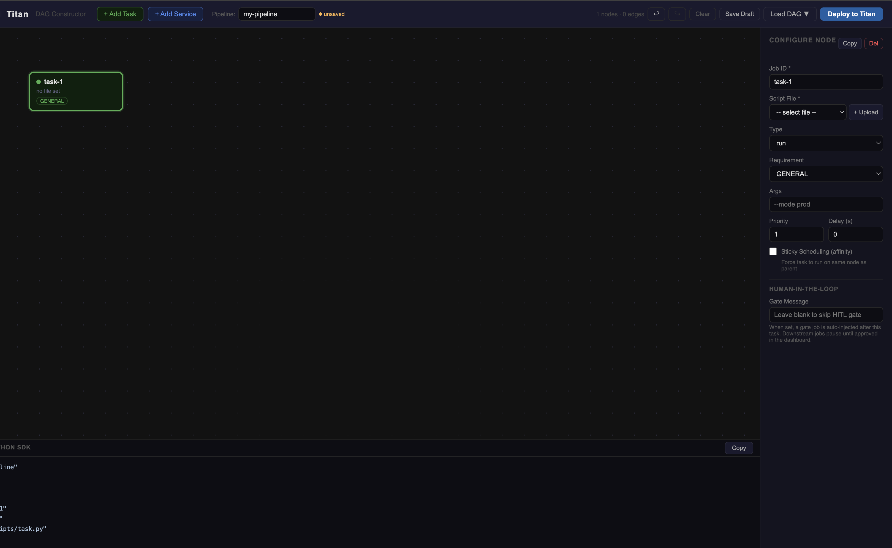
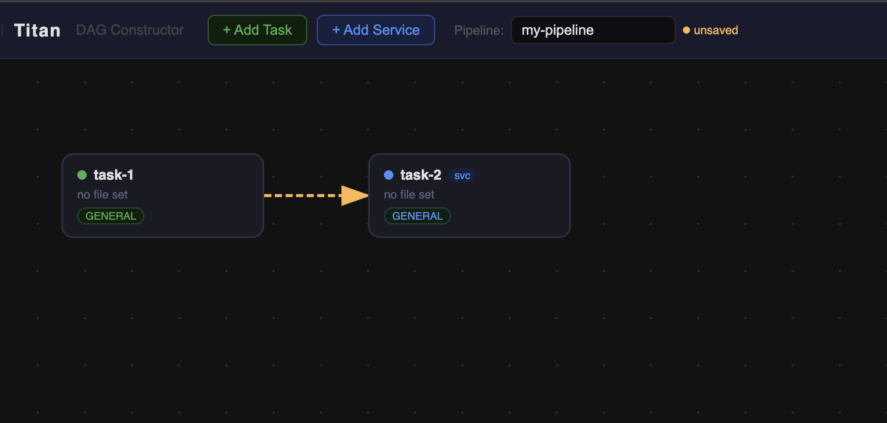

# Building DAGs

## Adding nodes

Click **+ Add Task** or **+ Add Service** in the topbar. Each click places a new node on the canvas at an auto-calculated position. Nodes snap to a 20px grid.



---

## Node configuration

Select a node to open the sidebar. Every field maps directly to a `TitanJob` property.

### Job ID `*`
Unique identifier for this job within the DAG. Used in dependency wiring, logs, and the visualizer.

- Must be unique across all nodes in the canvas
- Alphanumeric, hyphens and underscores allowed
- Example: `preprocess`, `train-gpu`, `comp-synthesizer`

### Script File `*`
The Python script that runs on the worker. Select from the dropdown (lists all files in `perm_files/`) or click **+ Upload** to add a new script without leaving the constructor.

Uploaded scripts are saved to `perm_files/` and immediately available in the dropdown.

### Type

| Value | Behaviour |
|---|---|
| `run` | Script runs once and exits. Job completes when process exits 0. |
| `service` | Process stays alive. Master tracks it as a long-running service. |

### Requirement
Routes the job to a worker with matching capability. See [capability routing](overview.md#capability-routing).

### Args
Command-line arguments passed to the script at launch.

```
# Script receives: python train.py --epochs 10 --lr 0.001
args: --epochs 10 --lr 0.001
```

For positional args, order matters and must match the script's `sys.argv` expectations.

### Priority
Integer 1–10. Higher priority jobs are dispatched first when multiple jobs are queued on the same worker. Default: `1`.

### Delay (seconds)
Wait this many seconds after all dependencies clear before dispatching. Useful for rate limiting or allowing a service to fully start before dependent jobs connect to it. Default: `0`.

### Sticky Scheduling (affinity)
When enabled, forces this job to run on the **same worker** that ran its parent job. Useful when jobs share local disk state.

!!! warning
    Do not combine `affinity: true` with a `requirement` that differs from the parent job's worker capability. The scheduler needs a worker that satisfies both constraints — if none exists, the job waits indefinitely.

### Port *(Service type only)*
The port the service process listens on. Recorded by the master for service discovery.

---

## Drawing edges (dependencies)

An edge from node A to node B means: **B will not start until A has completed successfully.**

To draw an edge:

1. Hover over the source node — a port (**●**) appears on its right edge
2. Click and drag from the port
3. Release over the target node
4. A blue curved arrow confirms the dependency

To delete an edge: click it (it turns orange/dashed) then press `Delete` or use the sidebar Delete Edge button.



---

## Multi-select

Drag on **empty canvas** to draw a blue selection rectangle. All nodes within the box are selected.

- **Shift+click** a node to add or remove it from the current selection
- Drag any selected node to move the whole group
- `Delete` / `Backspace` removes all selected nodes and their edges at once

When multiple nodes are selected the sidebar shows a multi-select panel instead of node config. Click a single node to edit it individually.

---

## Duplicate a node

Select a node and press **Ctrl+D** (or click **Copy** in the sidebar header). The duplicate appears offset by 40px with `-copy` appended to the Job ID. All field values are cloned.

---

## Undo / Redo

| Action | Shortcut |
|---|---|
| Undo | `Ctrl+Z` |
| Redo | `Ctrl+Y` or `Ctrl+Shift+Z` |

Undo/Redo tracks structural changes: add node, delete node, add edge, delete edge, duplicate. Drag position changes are not tracked.

The **↩ ↪** buttons in the topbar are disabled (greyed) when there is nothing to undo or redo.

---

## Cycle detection

Before deploying, the constructor runs a DFS cycle check on the edge graph. If a cycle is detected (e.g. A → B → A), deploy is blocked with a **"Cycle detected — check your dependencies."** error.

Titan's execution model does not support cycles in a DAG. Loops and conditional re-runs are expressed at the orchestrator layer, not inside the DAG structure. See [Architecture](../architecture/design.md) for the agentic loop pattern.

---

## Node badges

Nodes display small badges for at-a-glance status:

| Badge | Meaning |
|---|---|
| `HITL` (yellow) | A human approval gate is configured after this job |
| `svc` (blue) | Service type node |
| `sticky` (orange) | Affinity enabled |
| `p:N` (blue) | Priority above 1 |

The node border colour reflects its capability requirement (green = GENERAL, purple = GPU, blue = HIGH_MEM, orange = PYTHON).

---

## Live codegen

The **Output panel** at the bottom of the canvas shows YAML and Python SDK equivalents of the current canvas, updated live.

=== "YAML"

    ```yaml
    name: "ml-pipeline"
    project: true

    jobs:
      - id: "preprocess"
        type: "run"
        file: "preprocess.py"
        args: "dataset-001"

      - id: "train"
        type: "run"
        file: "train.py"
        requirement: "GPU"
        priority: 4
        depends_on: ["preprocess"]
    ```

=== "Python SDK"

    ```python
    from titan_sdk import TitanClient, TitanJob

    client = TitanClient()

    preprocess = TitanJob(
        job_id="preprocess",
        filename="preprocess.py",
        args="dataset-001",
    )

    train = TitanJob(
        job_id="train",
        filename="train.py",
        requirement="GPU",
        priority=4,
        parents=["preprocess"],
    )

    client.submit_dag("ml-pipeline", [preprocess, train])
    ```

Click **Copy** to copy the current tab's content to clipboard.
