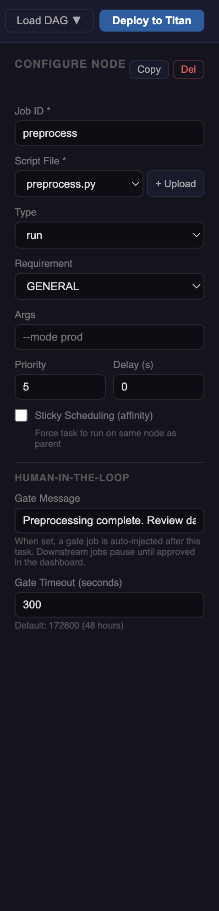

# Human-in-the-Loop (HITL) Gates

A HITL gate pauses a DAG at a defined checkpoint and waits for a human to approve or reject before downstream jobs proceed. This is useful for:

- Quality checks before an expensive training run
- Review of generated reports before publishing
- Compliance sign-off in regulated workflows
- Manual validation between pipeline stages

---

## How it works

HITL configuration lives on the **source node** — the job that must complete before the gate. You do not create a gate node manually; it is injected automatically at deploy time.

When a job has a Gate Message set:

1. The source job runs normally
2. A `hitl_gate` job is automatically inserted **after** the source job and **before** all its downstream dependents
3. The gate registers itself in the approval queue and waits
4. An approval banner appears in the [DAG Visualizer](../visualizer/hitl-approval.md)
5. On **Approve** — the gate exits cleanly, downstream jobs proceed
6. On **Reject** — the gate fails, downstream jobs are cancelled



---

## Configuring a gate

Select a node to open the sidebar and scroll to the **Human-in-the-Loop** section.

### Gate Message
The message shown to the operator in the approval banner in the dashboard.

```
Review preprocessing output before training begins.
Check preprocessing_report.txt in the workspace files panel.
```

Leave blank to skip — no gate is injected for that job.

### Gate Timeout (seconds)
Maximum time to wait for a human response before the gate automatically fails. Default: `172800` (48 hours).

```
172800   →  48 hours  (default — gives operator time to respond)
3600     →  1 hour
300      →  5 minutes (tight deadline, useful for testing)
```

If the timeout expires without a decision, the gate job fails and downstream jobs do not run.

---

## What gets injected

Given this canvas:

```
preprocess  →  train  →  evaluate
```

With a gate configured on `preprocess`, the deployed DAG becomes:

```
preprocess  →  hitl-gate-preprocess  →  train  →  evaluate
```

The gate job runs `hitl_gate.py` with the gate ID, timeout, and message as arguments. It is a standard Titan job — visible in the visualizer with its own log stream.

---

## HITL node badge

Nodes with a gate configured show a yellow **HITL** badge in the constructor canvas. This is a reminder that approval will be required at runtime — no action needed in the constructor itself.

---

## Approving and rejecting

See [HITL Approval in the Visualizer](../visualizer/hitl-approval.md) for the runtime workflow.

---

## Example — ML pipeline with pre-train review

```
preprocess (HITL: "Review data quality report before training")
    ↓
hitl-gate-preprocess  [auto-injected]
    ↓
train (GPU)
    ↓
evaluate
```

The operator opens the workspace files panel in the visualizer, downloads `preprocessing_report.txt`, reviews the data quality stats, then approves or rejects the gate.

=== "YAML"

    ```yaml
    jobs:
      - id: "preprocess"
        type: "run"
        file: "preprocess.py"
        hitl_message: "Review data quality report before training begins."
        max_wait_seconds: 300

      - id: "train"
        type: "run"
        file: "train.py"
        requirement: "GPU"
        depends_on: ["preprocess"]
    ```

=== "Python SDK"

    ```python
    preprocess = TitanJob(
        job_id="preprocess",
        filename="preprocess.py",
        hitl_message="Review data quality report before training begins.",
        max_wait_seconds=300,
    )

    train = TitanJob(
        job_id="train",
        filename="train.py",
        requirement="GPU",
        parents=["preprocess"],
    )
    ```

!!! info
    The `depends_on` / `parents` for `train` points to `preprocess`, not to the gate. The gate wiring is handled server-side at deploy time. Your code stays clean.
