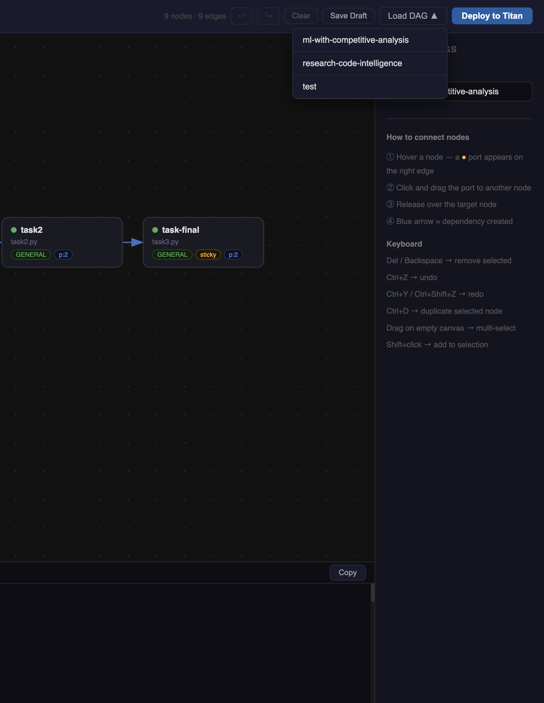
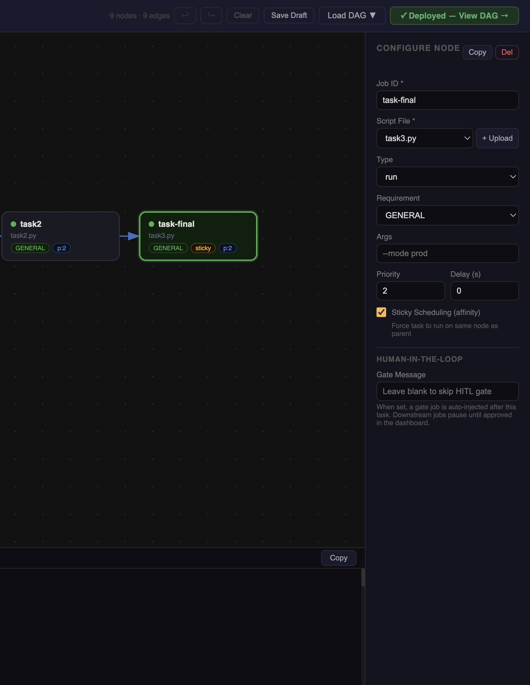

# Managing DAGs

## Saving drafts

The constructor saves your canvas automatically so work is never lost, and also gives you an explicit save button for on-demand saves.

### Autosave
Two seconds after any change to the canvas (nodes, edges, or pipeline name), the state is saved automatically to the server. A status indicator in the topbar shows the current state:

| Indicator | Meaning |
|---|---|
| `saving…` | Autosave in progress |
| `✓ draft saved` | Successfully saved |
| `● unsaved` (yellow dot) | Canvas has changes not yet deployed to master |

Autosave writes to `.dag_constructor_states.json` on the server. The draft persists across browser refreshes and tab closes.

### Save Draft button
Click **Save Draft** in the topbar to save immediately without waiting for the autosave debounce. Useful just before closing the browser or sharing the URL with someone who will load it.

!!! note
    **Save Draft** and **Deploy** are different operations. Saving a draft preserves the canvas for later editing. Deploying submits the DAG to the Titan master for execution. You can save a draft many times without deploying.

---

## The dirty state indicator

A yellow **● unsaved** dot appears next to the pipeline name whenever the current canvas differs from the last deployed version. It disappears after a successful deploy.

This tracks "deployed to master" state, not "saved to disk" — so a saved draft still shows the dot if it hasn't been deployed yet. That is intentional: the two states mean different things.

---

## Loading a saved DAG for editing

Click **Load DAG** in the topbar to open a dropdown of all previously saved canvases. Click a name to restore it:

- All node positions, field values, and edges are restored exactly
- The pipeline name is set to the loaded DAG's name
- The canvas is marked clean (no dirty dot) since the loaded state matches the last saved version

If the canvas currently has nodes, a confirmation dialog asks before clearing it.

### Common edit workflow

1. Open the constructor → click **Load DAG** → select your pipeline
2. Make changes (add nodes, adjust args, change timeout)
3. The yellow `● unsaved` dot appears as soon as you change anything
4. Click **Deploy to Titan** when ready — a new run is submitted with the updated config

---

## Redeploying

Deploying a pipeline name that was previously deployed shows a confirmation:

> **"my-pipeline" has been deployed before.**
> This submits a new run — it does not update or replace the existing one.
> Proceed?

This is intentional. Each deploy creates a **new run** of the DAG. Previous runs are not affected. The confirmation prevents accidental double-deploys when you meant to just save a draft.

---

## Clearing the canvas

Click **Clear** in the topbar to remove all nodes and edges. This does not delete any saved draft — the last saved version is still available via **Load DAG**.

---

## Pipeline naming

The pipeline name (editable in both the topbar input and the sidebar DAG Settings panel) becomes the DAG name prefix in the visualizer: a pipeline named `ml-pipeline` creates a DAG visible at `/dags/DAG-ml-pipeline`.

Use descriptive names. Once a DAG is deployed under a name, that name appears in logs, the visualizer URL, and the workspace file filter.

---

## After deploy

After a successful deploy the **Deploy to Titan** button is replaced by a green **"✓ Deployed — View DAG →"** link. Click it to open the [DAG Visualizer](../visualizer/overview.md) for the running pipeline in a new tab.

