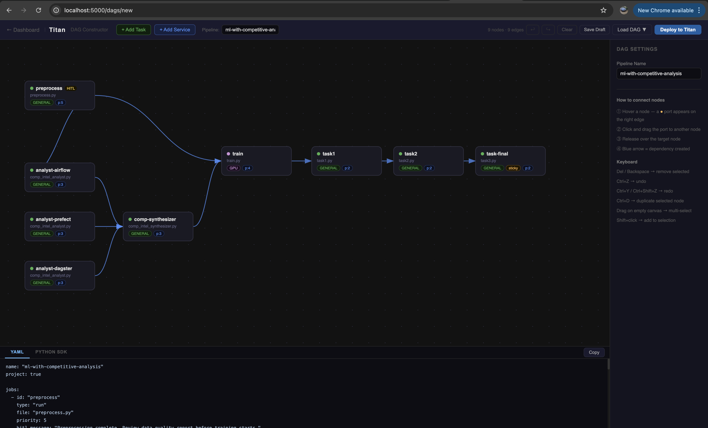

# DAG Constructor — Overview

The DAG Constructor is a visual, browser-based pipeline builder built into the Titan Dashboard. It lets you design, configure, and deploy DAGs without writing any code — and generates equivalent YAML or Python SDK output as you build.

**Open it at:** `http://127.0.0.1:5000/dags/new`



---

## Layout

```
┌─────────────────────────────────────────────────────┬──────────┐
│  Topbar — pipeline name, actions, deploy            │          │
├────────────────────────────────────────────────────┤ Sidebar  │
│                                                    │          │
│  Canvas — drag nodes, draw edges                  │  Node    │
│                                                    │  Config  │
│                                                    │          │
├────────────────────────────────────────────────────┤          │
│  Output panel — live YAML / Python SDK preview    │          │
└────────────────────────────────────────────────────┴──────────┘
```

**Topbar** — add nodes, name the pipeline, undo/redo, save draft, load a previous DAG, deploy.

**Canvas** — the work area. Nodes are draggable. Edges are drawn by dragging from a node's output port to another node.

**Sidebar** — appears when a node is selected. Configure all job properties: script, capability, args, HITL gate, and more.

**Output panel** — live YAML and Python SDK codegen that updates as you build. Copyable with one click.

---

## Quick start

1. Click **+ Add Task** in the topbar to place a node on the canvas
2. Select the node — the sidebar opens
3. Set a **Job ID** and choose a **Script File** from the dropdown
4. Hover the node — a port (●) appears on its right edge
5. Drag from the port to another node to create a dependency edge
6. Click **Deploy to Titan** when ready

After a successful deploy, the button becomes a **"✓ Deployed — View DAG →"** link that opens the [DAG Visualizer](../visualizer/overview.md) for the run.

---

## Node types

| Type | Use for |
|---|---|
| **Task** (Run Payload) | Scripts that run once and exit — training, preprocessing, analysis |
| **Service** | Long-running processes that stay alive — model servers, API endpoints |

---

## Capability routing

Each node has a **Requirement** field that controls which worker receives the job:

| Requirement | Worker needed |
|---|---|
| `GENERAL` | Any available worker |
| `GPU` | Worker started with GPU capability |
| `HIGH_MEM` | Worker started with HIGH_MEM capability |
| `PYTHON` | Any Python-capable worker |

Workers advertise their capability at startup. The master only dispatches a job to a worker that matches its requirement.

---

## Next steps

- [Building DAGs](building-dags.md) — full node configuration reference
- [HITL Gates](hitl.md) — adding human approval steps
- [Managing DAGs](managing-dags.md) — save drafts, load for editing, redeploy
- [Keyboard Shortcuts](keyboard-shortcuts.md)
