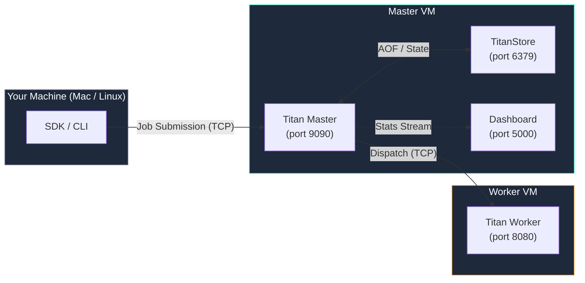

# Cloud Deployment (Multi-VM)

This guide walks through deploying a Titan cluster across two cloud VMs — one running the Master and one running a Worker. The same steps apply to any cloud provider (GCP, AWS, Azure) or bare-metal machines on a LAN.

!!! note "Local setup first?"
    If you haven't run Titan locally yet, start with the **[5-Minute Quickstart](../getting-started.md)**. This guide assumes you have a working local build.

---

## Architecture



The SDK and CLI run **locally** and submit jobs to the remote Master over TCP. The Master dispatches to Workers using their **internal IPs**.

---

## Prerequisites

- Two VMs with Java 17+ (Ubuntu 22.04 recommended)
- Ports **9090**, **8080**, and **5000** open in your cloud firewall
- A local build of Titan (`mvn clean package -DskipTests`)

### GCP firewall rule
```bash
gcloud compute firewall-rules create allow-titan \
  --allow tcp:9090,tcp:8080,tcp:5000 \
  --source-ranges 0.0.0.0/0
```

For AWS/Azure, open the same three ports in your Security Group / NSG inbound rules.

---

## Step 1 — Package the Bundles

Run this once from your local project root. It builds the JAR (if needed) and produces two zip files:

```bash
chmod +x package_cloud.sh
./package_cloud.sh
```

| File | Size | Purpose |
|---|---|---|
| `titan-master-bundle.zip` | ~2.3 MB | Everything needed to run the Master on a cloud VM |
| `titan-worker-bundle.zip` | ~120 KB | Worker JAR + titan_sdk for a remote worker node |

**Master bundle contents:**
```
titan-master-bundle/
├── perm_files/
│   ├── titan-orchestrator-1.0-SNAPSHOT.jar
│   ├── TitanStore.jar
│   ├── Worker.jar
│   ├── server_dashboard.py
│   ├── hitl_gate.py
│   └── Titan_logo.png
├── uploads/          ← job zip staging (AssetManager reads here)
└── start_master.sh   ← one-command startup
```

**Worker bundle contents:**
```
titan-worker-bundle/
├── Worker.jar
├── titan_sdk/        ← so job scripts can import titan_sdk
├── setup.py
└── start_worker.sh   ← one-command startup
```

---

## Step 2 — Set Up the Master VM

### 2.1 Install Java on the Master VM
```bash
sudo apt update && sudo apt install -y openjdk-17-jdk python3-pip
```

### 2.2 Upload and start

From your local machine:
```bash
scp titan-master-bundle.zip <USER>@<MASTER_EXTERNAL_IP>:~/
```

SSH into the Master VM, then:
```bash
unzip titan-master-bundle.zip
cd titan-master-bundle
chmod +x start_master.sh
./start_master.sh
```

`start_master.sh` installs Flask if missing, creates the `uploads/` directory, and starts TitanStore, Master, and Dashboard as background processes.

### 2.3 Verify the Master is up
```bash
tail -f ~/titan-master-bundle/master.log
```

You should see:
```
Clock Watcher Started...
Scheduler Core starting at port 9090
[OK] SchedulerServer Listening on port 9090
[INFO] Titan Auto-Scaler active.
```

Open `http://<MASTER_EXTERNAL_IP>:5000` in your browser to see the dashboard.

---

## Step 3 — Set Up the Worker VM

### 3.1 Install Java and the Python alias
```bash
sudo apt update && sudo apt install -y openjdk-17-jdk python-is-python3 python3-pip
```

!!! warning "`python-is-python3` is required"
    Titan Workers execute scripts using the `python` command. Ubuntu ships only `python3` by default — without this package the worker will fail to execute any Python job.

### 3.2 Upload and start

From your local machine:
```bash
scp titan-worker-bundle.zip <USER>@<WORKER_EXTERNAL_IP>:~/
```

SSH into the Worker VM. Use the Master's **internal IP** (`10.x.x.x`) for VM-to-VM communication:

```bash
unzip titan-worker-bundle.zip
cd titan-worker-bundle
chmod +x start_worker.sh
./start_worker.sh <MASTER_INTERNAL_IP>
```

`start_worker.sh` installs `titan_sdk`, exports `TITAN_HOST`/`TITAN_PORT`, and starts the worker. Default type is `GPU` on port `8085`.

#### Specialised worker configurations

```bash
# GENERAL worker on port 8086
./start_worker.sh <MASTER_INTERNAL_IP> 8086 GENERAL

# Additional GPU worker on port 8087
./start_worker.sh <MASTER_INTERNAL_IP> 8087 GPU true
```

You should immediately see in the Master VM's `master.log`:
```
Incoming connection from /WORKER_INTERNAL_IP Port...
[INFO] New Worker Registered: WORKER_INTERNAL_IP:8085 [PERMANENT] [GPU]
```

---

## Step 4 — Configure the SDK on Your Local Machine

### 4.1 Point the SDK at the remote Master

```bash
export TITAN_HOST=<MASTER_EXTERNAL_IP>
export TITAN_PORT=9090
```

Add these to `~/.zshrc` (or `~/.bashrc`) to make them permanent:
```bash
echo 'export TITAN_HOST=<MASTER_EXTERNAL_IP>' >> ~/.zshrc
echo 'export TITAN_PORT=9090'                 >> ~/.zshrc
source ~/.zshrc
```

### 4.2 Verify the SDK picks them up
```bash
python -c "from titan_sdk.titan_sdk import TITAN_HOST, TITAN_PORT; print(TITAN_HOST, TITAN_PORT)"
```

Must print your GCP external IP — not `127.0.0.1`.

### 4.3 Install the SDK
```bash
pip install -e .
```

---

## Step 5 — Submit Your First Remote Job

### Option A: Python SDK

No pre-staging needed — scripts are sent inline with the payload:

```bash
python titan_test_suite/examples/dynamic_dag_custom/complex_etl_pipeline/etl_pipeline.py
```

This submits a 7-job ETL pipeline (fan-out → fan-in) to the remote cluster. Watch it execute in the dashboard at `http://MASTER_EXTERNAL_IP:5000`.

### Option B: YAML CLI

```bash
python titan_sdk/titan_cli.py deploy titan_test_suite/examples/yaml_based_static_tests/dag_structure_test/agent.yaml
```

The CLI zips the project folder and uploads it to the Master before submitting the DAG.

### Option C: DAG Constructor

Open `http://MASTER_EXTERNAL_IP:5000/dags/new`, build your pipeline in the browser, and use the **Upload** button in the Constructor to stage your scripts directly — no SCP or pre-staging required. Once your scripts are uploaded, click **Deploy** to submit to the cluster.

---

## Managing the Cluster

### Stop all services
```bash
pkill -f "TitanStore.jar" ; pkill -f "TitanMaster" ; pkill -f "server_dashboard.py"
```

### View live logs
```bash
# From ~/titan-master-bundle/ on the Master VM
tail -f master.log      # Master activity and dispatch
tail -f store.log       # TitanStore / persistence
tail -f dashboard.log   # Flask dashboard

# Filter for key events only
grep "UPLOAD\|ARCHIVE\|DISPATCH\|ERROR\|Registered" master.log | tail -20
```

### Redeploy after a code change
```bash
# 1. On your local machine — rebuild and repackage
mvn clean package -DskipTests
./package_cloud.sh

# 2. Upload new master bundle to the VM
scp titan-master-bundle.zip <USER>@<MASTER_EXTERNAL_IP>:~/

# 3. On the Master VM — replace and restart
unzip -o ~/titan-master-bundle.zip -d ~/
pkill -f "TitanMaster"
sleep 1
cd ~/titan-master-bundle && bash start_master.sh
```

---

## IP Address Reference

| Connection | Which IP to use |
|---|---|
| Worker → Master (registration, heartbeats) | Master **internal** IP (`10.x.x.x`) |
| SDK / CLI → Master (job submission) | Master **external** IP |
| Browser → Dashboard | Master **external** IP |
| Worker VM SSH | Worker **external** IP |

---

## Troubleshooting

**Worker registers but jobs never dispatch**

Check that `python` resolves on the Worker VM:
```bash
python --version  # must work; if not: sudo apt install -y python-is-python3
```

**Dashboard shows jobs as separate pipelines instead of one grouped pipeline**

The SDK pushes the manifest to the dashboard automatically after every submission. Ensure port 5000 is reachable from your local machine and the dashboard is running.

**`DAG_ACCEPTED` returned but nothing appears in master logs**

The SDK is likely connecting to a local master instead of the remote one. Verify:
```bash
python -c "from titan_sdk.titan_sdk import TITAN_HOST; print(TITAN_HOST)"
# Must print the remote IP, not 127.0.0.1
```

**YAML `project: true` submission accepted but job never runs**

Confirm you are running the latest JAR on the Master (built after May 2026). Earlier builds had a directory mismatch bug in `AssetManager` that caused uploaded zips to be unfindable at dispatch time.
