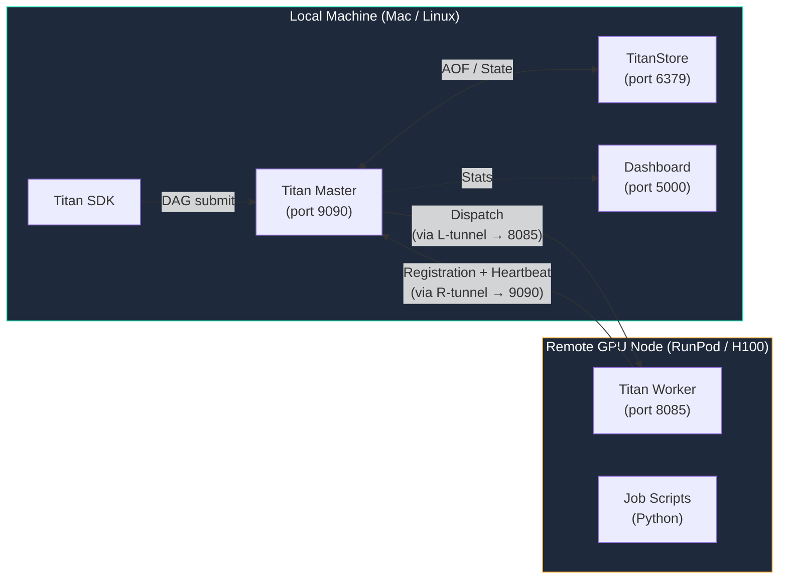

# Remote GPU Worker via SSH Tunnel

This guide shows how to connect a remote GPU machine (RunPod, vast.ai, or any cloud GPU instance) as a Titan worker to your **local Mac/Linux Master** using SSH tunnelling — no firewall rule changes or open ports required.

!!! note "Cloud VM setup?"
    If your Master is already on a cloud VM with open ports, see **[Cloud Deployment (Multi-VM)](cloud.md)**. This guide is for the pattern where the Master runs locally and the GPU worker is remote.

---

## Architecture



The SSH tunnel creates **two forwarding paths in one connection**:

| Direction | Tunnel flag | What it does |
|---|---|---|
| Worker → Master | `-R 9090:localhost:9090` | Worker calls `localhost:9090` on RunPod → arrives at Master port 9090 on your Mac |
| Master → Worker | `-L 8085:localhost:8085` | Master calls `localhost:8085` on your Mac → arrives at Worker port 8085 on RunPod |

---

## Prerequisites

- Titan running locally (`TitanStore`, `TitanMaster`, dashboard)
- A remote GPU instance with SSH access (RunPod, GCP, AWS, vast.ai, etc.)
- SSH key registered with the GPU instance
- Java 17+ on the GPU instance (`apt install openjdk-17-jdk`)
- `Worker.jar` copied to the GPU instance (see below)

---

## Provider Compatibility

This pattern works with any provider that gives you SSH access. The only difference is the SSH connection details:

| Provider | Host | Port | Notes |
|---|---|---|---|
| RunPod | shown in *Connect → SSH over exposed TCP* | custom (e.g. `50021`) | Use `root@<host>` |
| GCP VM | external IP from Console | `22` | Use your IAM username or `ssh-keygen` key pair |
| AWS EC2 | public IPv4 DNS | `22` | Use the key pair `.pem` file |
| vast.ai | shown in instance panel | custom | Similar to RunPod |
| Any VPS | your server IP | `22` | Standard SSH |

!!! info "GCP with local Master"
    GCP VMs work identically — standard SSH on port 22, no custom TCP exposure needed. The tunnel command is the same; just substitute `<GPU_HOST>` with the VM's external IP and omit `-p 22` (it's the default). No firewall rule changes required since the connection is outbound from the VM to your machine.

---

## Step 1 — Build the Worker Bundle

From your local project root, run the cloud packager (builds once, reuse for any provider):

```bash
chmod +x package_cloud.sh
./package_cloud.sh
```

This produces `titan-worker-bundle.zip` (~120 KB) containing `Worker.jar`, `titan_sdk`, and `start_worker.sh`.

Copy it to the GPU instance:

```bash
# RunPod (SSH over exposed TCP)
scp -P <SSH_PORT> -i ~/.ssh/id_ed25519 \
    titan-worker-bundle.zip \
    root@<GPU_HOST>:~/

# GCP / AWS / standard SSH (port 22)
scp -i ~/.ssh/id_ed25519 \
    titan-worker-bundle.zip \
    <USER>@<GPU_HOST>:~/
```

Replace `<SSH_PORT>` and `<GPU_HOST>` with the values shown in your GPU instance panel.

- **RunPod**: found under *Connect → SSH over exposed TCP*
- **GCP / AWS / Azure**: host is the external IP, port is `22` (standard SSH)

Then SSH into the instance and extract:

```bash
unzip titan-worker-bundle.zip
chmod +x titan-worker-bundle/start_worker.sh
```

!!! info "TitanStore access on the GPU worker"
    `store_put` and `store_get` go through the Master on port 9090 — the same port already forwarded by the `-R` tunnel. No extra port forwarding is needed. `start_worker.sh` sets `TITAN_HOST` automatically based on the master host argument you pass it.

---

## Step 2 — Open the Bidirectional SSH Tunnel

Run this **from your local machine** and keep the terminal open:

```bash
ssh -4 -N \
    -R 9090:localhost:9090 \
    -L 8085:localhost:8085 \
    -p <SSH_PORT> -i ~/.ssh/id_ed25519 \
    root@<GPU_HOST>
```

| Flag | Purpose |
|---|---|
| `-4` | Force IPv4 — prevents Master storing the worker address as `::1` (IPv6 loopback) which breaks dispatch |
| `-N` | No interactive shell — keeps the tunnel open without running a command |
| `-R 9090:localhost:9090` | Worker on RunPod can reach your local Master as `localhost:9090` |
| `-L 8085:localhost:8085` | Your local Master can dispatch to RunPod worker via `localhost:8085` |

The terminal will hang (no output) — that is correct. The tunnel is live.

!!! warning "IPv6 gotcha"
    Without `-4`, SSH may bind the reverse tunnel to `::1` (IPv6 loopback). The Master will store the worker address as `0:0:0:0:0:0:0:1:8085`, which cannot be reached during dispatch. Always include `-4`.

---

## Step 3 — Start the Worker on the GPU Instance

In a separate SSH session into the GPU instance:

```bash
cd ~/titan-worker-bundle
./start_worker.sh localhost
```

`start_worker.sh` sets `TITAN_HOST=localhost`, installs `titan_sdk`, and starts the worker on port `8085` as a permanent GPU worker. `localhost` here resolves to your local Master via the `-R` tunnel.

| Argument | Value | Meaning |
|---|---|---|
| Port | `8085` | Worker listens on this port (matched by `-L` tunnel) |
| Master host | `localhost` | Reaches your local Master via the `-R` tunnel |
| Master port | `9090` | Standard Master port |
| Type | `GPU` | Only jobs with `requirement="GPU"` will route here |
| Permanent | `true` | Worker re-registers after job completion |

You should see in your **local** `master.log`:
```
Incoming connection from /127.0.0.1 Port...
[INFO] New Worker Registered: 127.0.0.1:8085 [PERMANENT] [GPU]
```

The worker appears in the **Orchestrator** tab of the dashboard at `http://localhost:5000`.

---

## Step 4 — Submit a GPU+CPU Pipeline

The included example `gpu_kv_pipeline` demonstrates the full multi-node pattern:

- **CPU job** (`GENERAL` worker, local) generates a synthetic dataset and pushes it to **TitanStore**
- **GPU job** (`GPU` worker, RunPod) reads the dataset from TitanStore using `titan_sdk`, trains, and writes `model_report.txt` to the workspace
- Both jobs are submitted as a **single DAG** — the Visualizer shows them as one connected pipeline with a proper dependency edge

```
titan_test_suite/examples/dynamic_dag_custom/gpu_kv_pipeline/
├── gpu_kv_pipeline.py        ← orchestrator (runs locally)
└── scripts/
    ├── cpu_prepare.py        ← GENERAL worker: generates data → pushes to TitanStore
    └── gpu_compute.py        ← GPU worker: reads from TitanStore, trains, writes report
```

Run it:

```bash
python titan_test_suite/examples/dynamic_dag_custom/gpu_kv_pipeline/gpu_kv_pipeline.py
```

### How the data flows

```python
# cpu_prepare.py — pushes dataset JSON to TitanStore
store.store_put(f"gpu_pipeline_{RUN_ID}_dataset", json.dumps(dataset))

# gpu_compute.py — reads it back (titan_sdk installed on RunPod)
raw     = store.store_get(f"gpu_pipeline_{RUN_ID}_dataset")
dataset = json.loads(raw)
num_samples, mean, std = dataset["num_samples"], dataset["mean"], dataset["std"]

# gpu_kv_pipeline.py — single DAG, GPU job depends on CPU job
gpu_job = TitanJob(..., parents=[cpu_job.id], requirement="GPU")
client.submit_dag(f"GPU_KV_PIPELINE_{run_id}", [cpu_job, gpu_job])
```

Titan enforces the dependency — `gpu_compute` only starts after `cpu_prepare` completes successfully. No polling loop needed in the orchestrator.

---

## Step 5 — Download Logs and Output Files

### Live logs (STDOUT/STDERR panel)

The GPU worker streams stdout/stderr back to the Master in real-time via the TCP tunnel. You can see the full output — epoch progress, errors, print statements — in the **STDOUT/STDERR** panel of the job card in the Visualizer. No extra setup needed.

### Workspace files

!!! warning "Remote workers do not auto-upload files"
    **Local workers** (running on the same machine as the Master) write their `.log` files and workspace artifacts directly into the Master's `titan_workspace/` directory, so they appear automatically in the Workspace Files listing.

    **Remote workers** (RunPod, SSH tunnel) write files to their own local filesystem. Those files never reach the Master unless the job script explicitly uploads them using the SDK.

    This means:

    - `DAG-cpu-prepare-xxx.log` ✓ appears in Workspace Files (local worker)
    - `DAG-gpu-compute-xxx.log` ✗ does **not** appear (lives on RunPod only)
    - `model_report.txt` ✓ appears **only because** `gpu_compute.py` calls `store.upload_file("model_report.txt")`

To make any output file from a remote worker downloadable, call `upload_file` at the end of your job script:

```python
from titan_sdk import TitanClient
store = TitanClient()

# Write your output
with open("my_output.txt", "w") as f:
    f.write(results)

# Push it to the Master so it appears in Dashboard > Workspace Files
store.upload_file("my_output.txt")
```

Open `http://localhost:5000` → **Visualizer** → select the GPU job → **Workspace Files** to download `model_report.txt`.

---

## Routing Reference

Titan routes jobs based on the `requirement` field in `TitanJob`:

| `requirement` | Worker type | Where it runs |
|---|---|---|
| `"GENERAL"` | Any `GENERAL` worker | Local worker (port 8080) |
| `"GPU"` | `GPU` worker only | RunPod worker via tunnel (port 8085) |
| `"HIGH_MEM"` | `HIGH_MEM` worker | Wherever a matching worker is registered |

---

## Troubleshooting

### Worker registers but GPU jobs queue and never dispatch

Check that the `-L` forward tunnel is active. The Master dispatches by calling `localhost:8085` — if the tunnel is closed, the connection is refused.

Re-run the SSH tunnel command and verify the worker re-registers in `master.log`.

### Dispatch loop crash (`CRITICAL: Dispatch Loop Died Unexpectedly!`)

A dispatch error can kill the loop. Restart the Master:

```bash
pkill -f TitanMaster
sleep 1
java -cp perm_files/titan-orchestrator-1.0-SNAPSHOT.jar titan.TitanMaster > master.log 2>&1 &
```

The worker will re-register on its next heartbeat — no need to restart it.

### Stale jobs block new ones

If the queue is flooded with old jobs (e.g. from a previous agentic run), clear TitanStore state:

```bash
# Stop everything
pkill -f TitanStore ; pkill -f TitanMaster ; pkill -f server_dashboard

# Clear the AOF (persisted job queue)
rm -f database6379.aof

# Restart
java -jar perm_files/TitanStore.jar > store.log 2>&1 &
sleep 2
java -cp perm_files/titan-orchestrator-1.0-SNAPSHOT.jar titan.TitanMaster > master.log 2>&1 &
~/titan-env/bin/python3 perm_files/server_dashboard.py > dashboard.log 2>&1 &
```

!!! warning "Delete the AOF before restarting TitanStore"
    Deleting the AOF file while TitanStore is still running has no effect — the old state is already in memory. Always stop TitanStore first, then delete, then restart.

### `store_get` returns `"nil"` instead of `None`

TitanStore returns the string `"nil"` for missing keys. Always guard your poll loops:

```python
try:
    data = json.loads(raw)
except (json.JSONDecodeError, TypeError):
    pass  # key not ready yet
```

### Worker not visible in the dashboard Orchestrator tab

The dashboard reads worker state from the Master's in-memory registry. Check `master.log` for `New Worker Registered` — if present, the worker is registered. Refresh the dashboard; it polls on a short interval.
