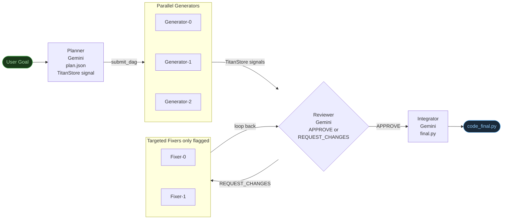
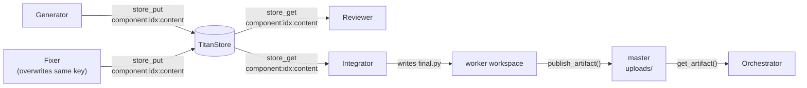

# Code Generation Agent — Agentic Loop Example

**What makes this agentic:** The Reviewer LLM decides at runtime whether generated code is acceptable or needs targeted fixes — and exactly which components to re-run. The fix loop only touches flagged components, not the whole codebase.

---

## How It Differs from the Research Agent

| | Research Agent | Code Generation Agent |
|---|---|---|
| Loop decision | SYNTHESIZE / DEEPEN | APPROVE / REQUEST_CHANGES |
| Fix targeting | All gaps re-researched equally | Only flagged components fixed |
| Parallel stage | Researchers (one per subtopic) | Generators (one per component) |
| Terminal stage | Synthesizer (report) | Integrator (runnable code) |
| Stage count | 4 fixed | 4+ dynamic (grows with fix iterations) |
| Chain in UI | PLAN→ITER→EVAL→SYNTH | PLAN→GEN→REVIEW→FIX→REVIEW→...→INTEGRATE |

Both share the same planner pattern — one LLM call to decompose the goal — but the loop condition, fix strategy, and output are fundamentally different.

---

## Architecture



---

## Coordination: TitanStore + File Transfer

Three layers, each with a distinct role:

| Layer | What's stored | Who reads it |
|---|---|---|
| **TitanStore (KV)** | Completion signals, plan JSON, component code content, review decisions, final file basename | All workers + orchestrator |
| **Worker-local workspace** | `final.py` — written to `titan_workspace/shared` on the worker node | Uploaded after write |
| **Master `uploads/`** | Uploaded final file — served via `OP_FETCH_ASSET` | Orchestrator |

**Component code lives entirely in TitanStore** — generators write code directly to `code:{run_id}:component:{idx}:content`, the fixer overwrites the same key with the fixed version, the reviewer and integrator read from it. No file transfer between workers needed. Only the final integrated file is large enough to warrant `publish_artifact()` → `get_artifact()`.

!!! warning "titan_workspace/shared is local to the worker node"
    `titan_workspace/shared` is the CWD for all DAG worker scripts — but it exists **on the worker node**, not on the master. In a distributed deployment the orchestrator cannot access it directly. The integrator calls `publish_artifact(key, filename)` to upload the final file to the master's `uploads/` directory; the orchestrator calls `get_artifact(key, save_path=...)` to download it.



---

## File Structure

```
perm_files/
├── code_planner.py       # Decomposes goal into components
├── code_generator.py     # Generates code for one component (reads plan.json)
├── code_reviewer.py      # Reviews all components: APPROVE or REQUEST_CHANGES
├── code_fixer.py         # Fixes one flagged component (targeted, minimal)
└── code_integrator.py    # Merges all components into final runnable file

titan_test_suite/examples/agents_examples/code_gen_agent/
└── code_gen_agent.py     # Orchestrator — holds the agentic while loop
```

---

## Agentic Loop (Orchestrator)

```python
# Stage 1: Planner — decomposes goal
client.submit_dag("PLAN", [planner_job], agent_run_id=run_id)
wait_for_signal(client, f"code:{run_id}:planner:done")
# Plan JSON stored in TitanStore by the planner — no file read needed
plan       = json.loads(client.store_get(f"code:{run_id}:plan"))
components = sorted(plan["components"], key=lambda c: c["idx"])

# Stage 2: Generate all components in parallel
# Each generator stores its code in TitanStore: code:{run_id}:component:{idx}:content
client.submit_dag("GEN1", generator_jobs, agent_run_id=run_id)
wait_for_signals(client, generator_signal_keys)

# Stage 3: Review → fix loop
while iteration < max_iterations:
    client.submit_dag(f"REVIEW{iteration}", [reviewer_job], agent_run_id=run_id)
    wait_for_signal(client, f"code:{run_id}:reviewer:{iteration}:done")

    # Review decision stored in TitanStore by the reviewer
    review = json.loads(client.store_get(f"code:{run_id}:review:{iteration}"))
    if review["decision"] == "APPROVE":
        break                             # ← LLM says code is good

    issues = review["issues"]            # ← only flagged components
    fixer_jobs = [TitanJob per issue]    # ← targeted, not all components
    # Each fixer reads content from TitanStore, fixes it, writes back to same key
    client.submit_dag(f"FIX{iteration}", fixer_jobs, agent_run_id=run_id)
    wait_for_signals(client, fixer_signal_keys)
    iteration += 1

# Stage 4: Integrate — reads all component content from TitanStore,
# writes final.py, publishes to master
client.submit_dag("INTEGRATE", [integrator_job], agent_run_id=run_id)
wait_for_signal(client, f"code:{run_id}:integrator:done")

# Download final file published by integrator
client.get_artifact(f"code:{run_id}:final", save_path=f"/tmp/code_{run_id}_final.py")
```

**Key difference from Research Agent:** `fixer_jobs` only contains jobs for flagged components — not all components. If 1 of 4 components has an issue, only 1 fixer job is submitted. The fixer overwrites the TitanStore key for that component — the reviewer on the next iteration reads the updated content automatically.

---

## Running It

**Prerequisites**

```bash
pip install google-genai python-dotenv
```

Add to `.env`:
```
GEMINI_API_KEY=your_key_here
```

**Run**

```bash
# Default goal
python titan_test_suite/examples/agents_examples/code_gen_agent/code_gen_agent.py

# Custom goal
python titan_test_suite/examples/agents_examples/code_gen_agent/code_gen_agent.py \
  "Build a Python REST API client with retry logic and response caching"

# Limit review iterations
python titan_test_suite/examples/agents_examples/code_gen_agent/code_gen_agent.py \
  "Build a CSV data processor with validation and statistics" --max-iter 2
```

---

## Example Run Output

```
[AGENT] Stage 1 — Planner: decomposing goal into components...
[AGENT]   planner — done
[AGENT] Planner decomposed into 3 components:
  [0] task_core — Manages in-memory task collection and priority logic...
  [1] json_persistence — Handles loading and saving to JSON file...
  [2] cli_interface — Provides CLI argument parsing and user interaction...

[AGENT] Stage 2 — Generating 3 components in parallel...
[AGENT]   generator-json_persistence — done    ← out of order: truly parallel
[AGENT]   generator-task_core — done
[AGENT]   generator-cli_interface — done

[AGENT] Stage 3 — Reviewer (iteration 1/3)...
[AGENT]   reviewer-1 — done
[AGENT]   Reviewer: 2 issue(s) found — spawning targeted fixers:
    [0] cli_interface: TaskCore never instantiated in run_cli()
    [1] cli_interface: Calls non-existent method _load_init()
[AGENT]   fixer-cli_interface — done    ← only cli_interface fixed, not all 3
[AGENT]   fixer-cli_interface — done

[AGENT] Stage 3 — Reviewer (iteration 2/3)...
[AGENT]   reviewer-2 — done
[AGENT]   Reviewer: code approved — proceeding to integration.

[AGENT] Stage 4 — Integrator: merging 3 approved component(s)...
[AGENT]   integrator — done
[AGENT] Done. Final code downloaded → /tmp/code_<id>_final.py
```

Notice the reviewer found bugs in `cli_interface` only — the fixer ran twice for that one component while `task_core` and `json_persistence` were untouched.

---

## What the Output Contains

The integrator produces a single runnable Python file with:
- Module-level docstring describing the full system
- Each component as a clearly labelled section
- Resolved imports and naming conflicts
- A `main()` function demonstrating the system end-to-end
- `if __name__ == "__main__": main()` entry point

---

## What Goals This Agent Works For

Any coding goal that naturally breaks into 3-4 independent modules:

| Goal | Likely components |
|---|---|
| CLI task manager | data model, persistence, CLI interface |
| REST API client | request builder, retry logic, response cache |
| CSV data processor | parser, validator, statistics engine, reporter |
| Web scraper | HTTP client, HTML parser, rate limiter, storage |
| Config management system | schema, parser, validator, writer |

---

## Agentic Checklist

- [x] **LLM makes a routing decision** — reviewer's `APPROVE` / `REQUEST_CHANGES` drives control flow
- [x] **Targeted fix loop** — only flagged components re-run, not the full generation stage
- [x] **Dynamic DAG** — number of fixer jobs per iteration depends on reviewer's issue count
- [x] **Goal-directed** — loop continues until reviewer approves or max iterations reached
- [x] **Bounded** — `max_iterations` guard prevents runaway loops
- [x] **Observable** — each stage is a named DAG visible in the Dashboard and Agent Runs view
- [x] **TitanStore coordination** — every worker signals completion; orchestrator polls keys
