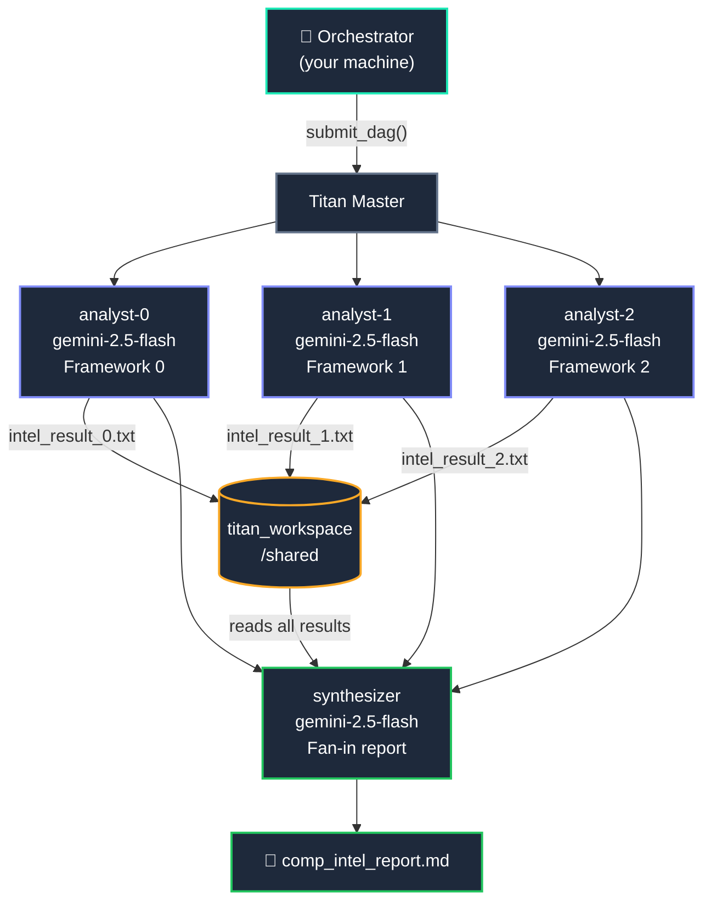

# Distributed LLM Pipeline — Parallel Analyst

A parallel, fan-out/fan-in pipeline where multiple Gemini agents analyse competing frameworks simultaneously and a synthesis agent consolidates the results into a structured report.

This example demonstrates Titan as a **distributed LLM pipeline runner** — the same pattern used in data engineering (MapReduce, ETL) but with LLM calls as the compute step.

---

## What It Does

Given a topic and a list of frameworks or products to compare, the pipeline:

1. Spawns **N analyst agents in parallel** — one per framework — each calling Gemini independently
2. Each analyst writes its result to the **shared workspace**
3. A **synthesis agent** (dependent on all analysts completing) reads all results and calls Gemini to produce a structured comparison report



---

## Titan Features Demonstrated

| Feature | How it appears |
|---|---|
| **Parallel fan-out** | All N analyst jobs dispatch simultaneously to available workers |
| **Fan-in dependency** | Synthesizer declares `parents=[analyst-0, analyst-1, ..., analyst-N]` — cannot start until every analyst completes |
| **Dynamic DAG** | Number of analyst jobs equals number of frameworks passed — DAG shape is decided at runtime |
| **Live log streaming** | Each analyst streams its Gemini response preview to the Dashboard log viewer in real time |
| **Shared workspace** | Analyst results written to `titan_workspace/shared/` — accessible by all workers without TitanStore |

---

## Prerequisites

=== "Install"

    ```bash
    pip install google-genai python-dotenv
    ```

=== ".env"

    Create a `.env` file at the project root:

    ```
    GEMINI_API_KEY=your_key_here
    ```

---

## Run It

```bash
# Default — compares LangGraph, CrewAI, AutoGen
python titan_test_suite/examples/agents_examples/comp_intel/comp_intel_pipeline.py

# Custom topic + frameworks (wrap multi-word names in quotes)
python titan_test_suite/examples/agents_examples/comp_intel/comp_intel_pipeline.py \
  "Cloud AI Platforms" "AWS SageMaker" "Google Vertex AI" "Azure ML"

# Any domain
python titan_test_suite/examples/agents_examples/comp_intel/comp_intel_pipeline.py \
  "JavaScript Frameworks" "React" "Vue" "Svelte"
```

Watch it run at **http://localhost:5000** — analyst nodes turn orange as they execute in parallel, then green as they complete. The synthesizer node activates only after all analysts are green.

---

## Output

The synthesis report is saved to:

```
titan_workspace/shared/comp_intel_<frameworks>_<run_id>.md
```

**Report structure (generated by Gemini):**

1. Executive Summary
2. Head-to-Head Comparison table
3. Key Differentiators (one paragraph per framework)
4. Recommendation Matrix ("Choose X if...")

---

## Files

| File | Role |
|---|---|
| `titan_test_suite/examples/agents_examples/comp_intel/comp_intel_pipeline.py` | Orchestrator — builds DAG and submits |
| `perm_files/comp_intel_analyst.py` | Worker — analyses one framework with Gemini |
| `perm_files/comp_intel_synthesizer.py` | Worker — reads all results, synthesizes final report |

---

## Extend It

**Add more frameworks** — just pass more args:

```bash
python comp_intel_pipeline.py "Database Engines" \
  "PostgreSQL" "MongoDB" "Cassandra" "CockroachDB" "DynamoDB"
```

Up to 6 analysts run in parallel. Each additional framework adds one parallel job with zero code changes.

**Add a HITL gate** before synthesis — review the raw analyses before committing the Gemini synthesis call:

```python
gate_job = TitanJob(
    job_id   = "review-gate",
    filename = _HITL_GATE_SCRIPT,
    args     = "review-gate 3600 Analyses ready. Approve synthesis?",
    parents  = [f"analyst-{i}" for i in range(len(frameworks))],
)
synthesizer_job = TitanJob(
    ...
    parents = ["review-gate"],   # depends on gate, not analysts directly
)
```

---

!!! note "Distributed LLM Pipeline vs Agentic Pipeline"
    This example is a **distributed LLM pipeline** — the DAG is fixed at submission time and each worker executes a predetermined prompt. No agent makes a routing decision based on what it observes.

    For an example where agents dynamically decide what happens next, see the [Research Agent](research-agent.md).
