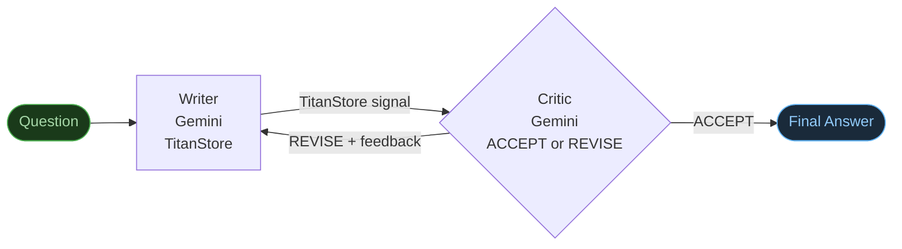

# Build Your First Agent in 10 Minutes

The simplest agentic pattern: a **Writer** produces an answer, a **Critic** says *accept* or *revise*, and the loop continues until the Critic is satisfied.

Two worker scripts. One orchestrator. One `while` loop. That's it.

---

## What You're Building



The Critic's decision is the **only agentic element** — an LLM output that changes what runs next.

---

## Prerequisites

Titan running locally, plus:

```bash
pip install google-genai python-dotenv
```

`.env` at the project root:
```
GEMINI_API_KEY=your_key_here
```

---

## Step 1 — The Writer

Create `perm_files/qs_writer.py`:

```python
import sys, os
from dotenv import load_dotenv
load_dotenv()

def main():
    run_id    = sys.argv[1]
    iteration = sys.argv[2]
    question  = " ".join(sys.argv[3:]).replace("_", " ")

    from titan_sdk import TitanClient
    tc = TitanClient()

    # Pick up critic's feedback from TitanStore (empty on first iteration)
    feedback = tc.store_get(f"qs:{run_id}:feedback") or ""
    if feedback in ("NULL", "CLEARED"):
        feedback = ""

    from google import genai
    from google.genai import types

    prompt = f"Answer this question clearly in 3-4 sentences:\n{question}"
    if feedback:
        prompt += f"\n\nPrevious attempt was rejected. Critic's feedback:\n{feedback}\nAddress this in your new answer."

    client   = genai.Client(api_key=os.environ["GEMINI_API_KEY"])
    response = client.models.generate_content(
        model="gemini-2.5-flash",
        contents=prompt,
        config=types.GenerateContentConfig(temperature=0.5)
    )

    answer = response.text.strip()

    # Store the answer in TitanStore — orchestrator reads it directly from there
    tc.store_put(f"qs:{run_id}:answer", answer)
    # Signal completion
    tc.store_put(f"qs:{run_id}:writer:{iteration}:done", "1")
    print(f"[WRITER] Answer stored in TitanStore (iteration {iteration})", flush=True)

if __name__ == "__main__":
    main()
```

---

## Step 2 — The Critic

Create `perm_files/qs_critic.py`:

```python
import sys, os, json
from dotenv import load_dotenv
load_dotenv()

def main():
    run_id    = sys.argv[1]
    iteration = sys.argv[2]
    question  = " ".join(sys.argv[3:]).replace("_", " ")

    from titan_sdk import TitanClient
    tc = TitanClient()

    # Read the writer's answer directly from TitanStore
    answer = tc.store_get(f"qs:{run_id}:answer")

    from google import genai
    from google.genai import types

    prompt = f"""You are a strict quality reviewer.

Question: {question}
Answer: {answer}

Is this answer accurate, complete, and clearly written?
- If YES: return {{"decision": "ACCEPT"}}
- If NO:  return {{"decision": "REVISE", "feedback": "<one sentence on what to fix>"}}

Return ONLY the JSON, no markdown."""

    client   = genai.Client(api_key=os.environ["GEMINI_API_KEY"])
    response = client.models.generate_content(
        model="gemini-2.5-flash",
        contents=prompt,
        config=types.GenerateContentConfig(temperature=0.2)
    )

    text     = response.text.strip().strip("```json").strip("```").strip()
    decision = json.loads(text)

    # Store decision and feedback in TitanStore — orchestrator and writer read from there
    tc.store_put(f"qs:{run_id}:decision:{iteration}", json.dumps(decision))
    if decision["decision"] == "REVISE":
        tc.store_put(f"qs:{run_id}:feedback", decision.get("feedback", ""))

    # Signal completion
    tc.store_put(f"qs:{run_id}:critic:{iteration}:done", "1")
    print(f"[CRITIC] Decision: {decision['decision']}", flush=True)

if __name__ == "__main__":
    main()
```

---

## Step 3 — The Orchestrator

Create `titan_test_suite/examples/agents_examples/quickstart_agent/quickstart_agent.py`:

```python
import os, sys, uuid, time, json

_HERE = os.path.dirname(os.path.abspath(__file__))
_ROOT = os.path.abspath(os.path.join(_HERE, "..", "..", "..", ".."))
_PERM = os.path.join(_ROOT, "perm_files")

sys.path.insert(0, _ROOT)
from titan_sdk import TitanClient, TitanJob
from dotenv import load_dotenv
load_dotenv()

MAX_ITER = 3

def wait(client, key, label, timeout=120):
    deadline = time.time() + timeout
    while time.time() < deadline:
        v = client.store_get(key)
        if v and v not in (None, "NULL"):
            print(f"[AGENT]   {label} — done", flush=True)
            return True
        time.sleep(2)
    print(f"[AGENT]   TIMEOUT: {label}", flush=True)
    return False

def run(question):
    run_id = uuid.uuid4().hex[:10]
    client = TitanClient()
    tag    = run_id[:6]
    args   = question.replace(" ", "_")

    print(f"\n[AGENT] Question : {question}")
    print(f"[AGENT] Run ID   : {run_id}\n")

    for iteration in range(1, MAX_ITER + 1):
        print(f"[AGENT] --- Iteration {iteration}/{MAX_ITER} ---")

        # Submit Writer
        writer_job = TitanJob(
            job_id=f"qs-writer-{tag}-{iteration}",
            filename=os.path.join(_PERM, "qs_writer.py"),
            args=f"{run_id} {iteration} {args}",
            requirement="GENERAL", priority=5,
        )
        client.submit_dag(f"QS_{tag}_WRITE{iteration}", [writer_job], agent_run_id=run_id)
        wait(client, f"qs:{run_id}:writer:{iteration}:done", label="writer")

        # Submit Critic
        critic_job = TitanJob(
            job_id=f"qs-critic-{tag}-{iteration}",
            filename=os.path.join(_PERM, "qs_critic.py"),
            args=f"{run_id} {iteration} {args}",
            requirement="GENERAL", priority=6,
        )
        client.submit_dag(f"QS_{tag}_CRITIC{iteration}", [critic_job], agent_run_id=run_id)
        wait(client, f"qs:{run_id}:critic:{iteration}:done", label="critic")

        # Read the critic's decision directly from TitanStore — no filesystem access
        raw = client.store_get(f"qs:{run_id}:decision:{iteration}")
        decision = json.loads(raw)

        if decision["decision"] == "ACCEPT":
            print(f"[AGENT] Critic accepted the answer.")
            break
        else:
            print(f"[AGENT] Critic: REVISE — {decision.get('feedback', '')}")

    # Read the final answer from TitanStore
    answer = client.store_get(f"qs:{run_id}:answer")
    print(f"\n[AGENT] Final Answer:\n{answer}")

if __name__ == "__main__":
    q = " ".join(sys.argv[1:]) if len(sys.argv) > 1 else \
        "What is the difference between a process and a thread?"
    run(q)
```

---

## Run It

```bash
python titan_test_suite/examples/agents_examples/quickstart_agent/quickstart_agent.py \
  "What is the difference between a process and a thread?"
```

Expected output:

```
[AGENT] Question : What is the difference between a process and a thread?
[AGENT] Run ID   : a3f9c1...

[AGENT] --- Iteration 1/3 ---
[AGENT]   writer — done
[AGENT]   critic — done
[AGENT] Critic accepted the answer.

[AGENT] Final Answer:
A process is an independent program in execution with its own memory space...
```

Or if the critic asks for a revision:

```
[AGENT] --- Iteration 1/3 ---
[AGENT]   writer — done
[AGENT]   critic — done
[AGENT] Critic: REVISE — Answer lacks a concrete example.

[AGENT] --- Iteration 2/3 ---
[AGENT]   writer — done       ← writer reads feedback and rewrites
[AGENT]   critic — done
[AGENT] Critic accepted the answer.
```

---

## The Three Things That Make It Agentic

**1. LLM output drives control flow**

```python
if decision["decision"] == "ACCEPT":
    break                              # stop
else:
    # loop — writer will read feedback on next iteration
```

The `if` branch isn't hardcoded logic — it's reading an LLM decision.

**2. Two ways to pass data from worker to orchestrator**

For **small content** (decisions, short answers) — store the value directly in TitanStore:

```python
# Worker — store content, then signal
tc.store_put(f"qs:{run_id}:answer", answer_text)
tc.store_put(f"qs:{run_id}:writer:{iteration}:done", "1")

# Orchestrator — get content directly
answer = client.store_get(f"qs:{run_id}:answer")
```

For **larger files** (reports, generated code) — publish to the master node, retrieve via `get_artifact`:

```python
# Worker — write file to CWD (titan_workspace/shared — local to this node),
# then publish to master in one call
with open(f"report_{run_id}.md", "w") as f: f.write(report)
tc.publish_artifact(f"qs:{run_id}:report", f"report_{run_id}.md")
tc.store_put(f"qs:{run_id}:synth:done", "1")

# Orchestrator — download the published artifact in one call
client.get_artifact(f"qs:{run_id}:report", save_path=f"/tmp/report_{run_id}.md")
```

!!! warning "titan_workspace/shared is local to the worker node"
    `titan_workspace/shared` is the CWD for all DAG worker scripts — but it exists **on the worker node**, not on the master. In a distributed deployment the orchestrator running on a different machine cannot `open()` those files directly. `publish_artifact(key, filename)` uploads the file to the master's `uploads/` directory and registers it under a TitanStore key. `get_artifact(key, save_path=...)` downloads it.

**3. `agent_run_id` connects all iterations in the Dashboard**

```python
client.submit_dag("WRITE1", [writer_job], agent_run_id=run_id)
client.submit_dag("CRITIC1", [critic_job], agent_run_id=run_id)
client.submit_dag("WRITE2", [writer_job], agent_run_id=run_id)
# → All 4 stages appear as one agent run in the UI
```

---

## What to Try Next

Once this works, the next steps are small:

| What to add | How |
|---|---|
| Parallel workers | Pass a list of `TitanJob` to `submit_dag` instead of one |
| A planner stage | One LLM call before the loop to decompose the question |
| Targeted retries | Only re-run workers that were flagged, not all of them |
| Full research agent | See [Research Agent](research-agent.md) — adds parallel researchers and a synthesizer |
| Code generation | See [Code Generation Agent](code-gen-agent.md) — adds parallel generators and an integrator |
