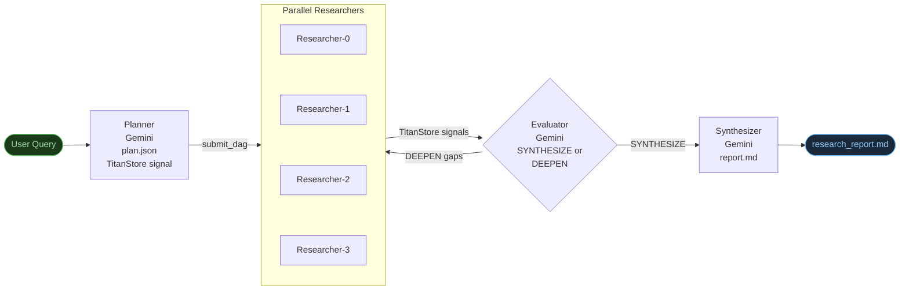
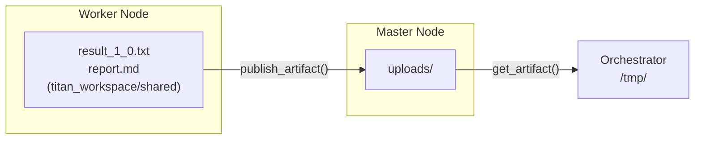

# Research Agent — Agentic Loop Example

**What makes this agentic:** An LLM (Gemini) makes a routing decision at runtime that changes which jobs are submitted next. The DAG shape is not fixed upfront — it grows or stops based on what the agent decides.

---

## The Core Distinction

| | Comp Intel Pipeline | Research Agent |
|---|---|---|
| DAG shape | Fixed at submission time | Grows at runtime based on LLM decision |
| Agent decisions | None — executes fixed prompts | Evaluator decides whether to loop or synthesize |
| Flow control | Hardcoded fan-out → synthesis | LLM-driven: plan → research → evaluate → loop or synthesize |
| TitanStore role | Not used | Signals completion of each stage |
| Qualifies as agentic? | No | **Yes** |

---

## Architecture



---

## Coordination: TitanStore + File Transfer

Three layers, each with a distinct role:

| Layer | What's stored | Who reads it |
|---|---|---|
| **TitanStore (KV)** | Completion signals, plan JSON, eval decisions, result file basenames, report basename | All workers + orchestrator |
| **Worker-local workspace** | `result_{iter}_{idx}.txt`, `report.md` — written to `titan_workspace/shared` on the worker node | Uploaded immediately after write |
| **Master `uploads/`** | Uploaded result and report files — served via `OP_FETCH_ASSET` | Evaluator, synthesizer, orchestrator |

!!! warning "titan_workspace/shared is local to the worker node"
    `titan_workspace/shared` is the CWD for all DAG worker scripts — but it exists **on the worker node**, not on the master. In a distributed deployment the orchestrator and other workers on different machines cannot access it directly. Workers call `publish_artifact(key, filename)` to upload to the master's `uploads/` directory and register the file under a TitanStore key. The orchestrator calls `get_artifact(key, save_path=...)` to download it. TitanStore is the only layer all nodes share in real time.



---

## File Structure

```
perm_files/
├── research_planner.py       # Calls Gemini to break query into subtopics
├── research_worker.py        # Calls Gemini to research one subtopic
├── research_evaluator.py     # Calls Gemini to decide SYNTHESIZE or DEEPEN
└── research_synthesizer.py   # Calls Gemini to write the final report

titan_test_suite/examples/agents_examples/research_agent/
└── research_agent.py         # Orchestrator — holds the agentic while loop
```

---

## Agentic Loop (Orchestrator)

```python
# Stage 1: Planner — decides what to research
client.submit_dag("PLAN", [planner_job], agent_run_id=run_id)
wait_for_signal(client, f"research:{run_id}:planner:done")
# Plan JSON stored in TitanStore by the planner — no file read needed
plan      = json.loads(client.store_get(f"research:{run_id}:plan"))
subtopics = plan["subtopics"]

while iteration < max_iterations:
    iteration += 1

    # Stage 2: Parallel researchers — one per subtopic
    client.submit_dag(f"ITER{iteration}", researcher_jobs, agent_run_id=run_id)
    wait_for_signals(client, researcher_signal_keys)

    # Stage 3: Evaluator — THE AGENTIC DECISION
    client.submit_dag(f"EVAL{iteration}", [evaluator_job], agent_run_id=run_id)
    wait_for_signal(client, f"research:{run_id}:eval:{iteration}:done")

    # Eval decision stored in TitanStore by the evaluator
    decision = json.loads(client.store_get(f"research:{run_id}:eval:{iteration}"))
    if decision["decision"] == "SYNTHESIZE":
        break                              # ← LLM says we're done
    else:
        subtopics = decision["gaps"]       # ← LLM says go deeper

# Stage 4: Synthesizer — merges everything into a final report
client.submit_dag("SYNTH", [synthesizer_job], agent_run_id=run_id)
wait_for_signal(client, f"research:{run_id}:synth:done")

# Download report published by synthesizer
client.get_artifact(f"research:{run_id}:report", save_path=f"/tmp/research_{run_id}_report.md")
```

The `while` loop lives in the orchestrator, not in any DAG. Titan handles parallel execution of each iteration. The LLM drives when to stop.

---

## Running It

**Prerequisites**

```bash
pip install google-genai python-dotenv
```

Add to `.env` at the project root:

```
GEMINI_API_KEY=your_key_here
```

**Run**

```bash
# Default query
python titan_test_suite/examples/agents_examples/research_agent/research_agent.py

# Custom query
python titan_test_suite/examples/agents_examples/research_agent/research_agent.py \
  "What are the tradeoffs of vector databases for production RAG systems?"

# Limit iterations
python titan_test_suite/examples/agents_examples/research_agent/research_agent.py \
  "How does LoRA work for LLM fine-tuning?" --max-iter 2
```

---

## Example Run Output

```
[AGENT] Stage 1 — Planner: breaking query into subtopics...
[AGENT]   planner — done
[AGENT] Planner decided 4 subtopics:
  [0] Performance, Scalability, and Latency Implications
  [1] Cost, Infrastructure, and Operational Overhead
  [2] Retrieval Quality, Relevance, and Embedding Management
  [3] Data Consistency, Freshness, and Integration Challenges

[AGENT] Iteration 1/3 — 4 subtopic(s)
[AGENT]   Submitted 4 researcher(s) in parallel...
[AGENT]   researcher-1-0 — done
[AGENT]   researcher-1-3 — done    ← out of order: truly parallel
[AGENT]   researcher-1-1 — done
[AGENT]   researcher-1-2 — done
[AGENT]   evaluator-1 — done
[AGENT]   Evaluator: research complete — proceeding to synthesis.

[AGENT] Stage 4 — Synthesizer: merging 4 research sections...
[AGENT]   synthesizer — done
[AGENT] Done. Report downloaded → /tmp/research_<id>_report.md
```

The researchers complete out of order because they run in parallel — each signals TitanStore independently as soon as Gemini responds.

---

## What the Report Contains

The synthesizer produces a structured Markdown report:

- **Executive Summary** — 3 sentences directly answering the query
- **Key Findings** — 5 concrete, specific bullet points
- **Deep Dive** — ~400 word integrated narrative connecting all research sections
- **Practical Recommendations** — 3–5 actionable takeaways
- **Open Questions** — honest gaps the research did not resolve

---

## Agentic Checklist

- [x] **LLM makes a routing decision** — evaluator's JSON output (`SYNTHESIZE` / `DEEPEN`) drives control flow
- [x] **Dynamic DAG** — number of researcher jobs changes per iteration based on gaps identified
- [x] **Goal-directed** — loop continues until evaluator judges research sufficient
- [x] **Bounded** — `max_iterations` guard prevents runaway loops
- [x] **Observable** — each iteration is a separate named DAG visible in the Dashboard
- [x] **TitanStore coordination** — workers signal completion via KV keys; orchestrator polls them

---

## What This Agent Works For

The query is the only variable. The planner, researchers, evaluator, and synthesizer are all general-purpose — they adapt to whatever topic is given. Any question that benefits from breaking into subtopics, researching each in depth, and synthesizing a report is a valid use case.

**Examples that work out of the box:**

| Domain | Example Query |
|---|---|
| Finance | `"Analyze NVIDIA earnings over the last 3 quarters and provide fundamental analysis"` |
| Finance | `"What are the key risks in the current US treasury yield curve?"` |
| Technology | `"What are the tradeoffs of vector databases for production RAG?"` |
| ML/AI | `"How does LoRA work for LLM fine-tuning?"` |
| Strategy | `"Compare multi-cloud vs single-cloud strategy for enterprise SaaS"` |
| Medicine | `"What are the current treatment approaches for type 2 diabetes?"` |
| Legal/Compliance | `"What does GDPR require for AI systems processing personal data?"` |

The agent spawns subtasks dynamically based on the query — NVIDIA earnings gets subtopics like revenue breakdown, margin trends, datacenter segment, guidance and analyst consensus. LoRA gets subtopics like math mechanism, training process, QLoRA, deployment patterns.

---

!!! note "Limitation"
    The researchers call Gemini with its training knowledge — they do not browse the web or call live APIs. For real-time financial data (exact quarterly figures, live prices), you would extend `research_worker.py` to call a financial data API (e.g. Alpha Vantage, Yahoo Finance, Polygon) and inject those numbers into the Gemini prompt alongside the research task.
