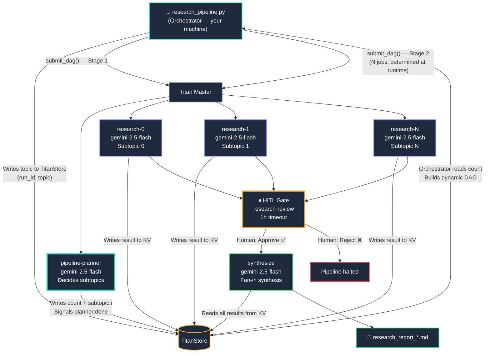

# Multi-Agent Research Pipeline

This example shows a **genuinely agentic workflow** built on Titan — the kind that is awkward or impossible to express in static DAG tools like Airflow or Prefect.

A Planner agent (Gemini) decides at runtime how many subtopics to research and what they are. The orchestrator cannot build the research DAG until the Planner completes — the DAG shape is unknown upfront. Parallel Gemini agents then research each subtopic independently on the distributed cluster. A human reviews the results before the final synthesis runs. The output is a polished Markdown report generated entirely by the agent network.

**What makes this agentic:** The Planner's output determines how many parallel workers are spawned. The orchestrator submits two separate DAGs — the first to run the Planner, the second (whose shape is only known after Stage 1) to run the research, review, and synthesis. The cluster topology is dynamic, not predetermined.



---

## What Titan Features This Demonstrates

| Feature | Where it appears |
|---|---|
| **Agentic planning** | Planner LLM decides subtopic count and names — the orchestrator has no input on this |
| **Dynamic DAG construction** | Stage 2 job count equals `count` returned by the Planner — not hardcoded |
| **Two-phase DAG submission** | Stage 1 (Planner) must complete before Stage 2 DAG can be built and submitted |
| **TitanStore as agent memory** | Orchestrator writes topic; Planner writes the plan; researchers write results; synthesis reads all |
| **Parallel fan-out** | All N research jobs dispatch simultaneously across available workers |
| **Fan-in dependency** | HITL gate and synthesis cannot start until all research jobs complete |
| **Human-in-the-Loop** | Gate halts execution and waits for your Approve/Reject in the Dashboard |
| **Live log streaming** | Each Gemini response streams to the Dashboard log viewer in real time |
| **Capability routing** | Workers declare `GENERAL`; adding a `GPU` worker would let you route synthesis there |

---

## Prerequisites

=== "Install"

    ```bash
    # 1. Gemini SDK — needed on every worker node
    pip install google-genai python-dotenv

    # 2. Set your API key in the environment
    export GEMINI_API_KEY="your_key_here"

    # 3. Make sure Titan is running
    ./titan-dev up
    ```

=== "Worker scripts"

    Worker scripts live alongside the orchestrator — no extra setup needed:

    | Script | Purpose |
    |---|---|
    | `research_pipeline/pipeline_planner.py` | Calls Gemini to decide subtopic count and names — the agentic stage |
    | `research_pipeline/research_subtopic.py` | Calls Gemini to research one subtopic, stores result in TitanStore |
    | `research_pipeline/synthesize_report.py` | Reads all subtopic results, calls Gemini for final synthesis |
    | `research_pipeline/hitl_gate.py` | Pauses execution and waits for Dashboard Approve/Reject |

---

## Quick Start

```bash
# Default topic: "The future of AI agents in software engineering"
python titan_test_suite/examples/agents_examples/research_pipeline/research_pipeline.py

# Custom topic — Planner decides how many subtopics to spawn
python titan_test_suite/examples/agents_examples/research_pipeline/research_pipeline.py \
  "Quantum computing in finance"

# More complex topic — Planner will spawn more subtopics automatically
python titan_test_suite/examples/agents_examples/research_pipeline/research_pipeline.py \
  "The impact of LLM agents on enterprise software development"
```

---

## What Happens Step by Step

### 1. Orchestrator writes topic to TitanStore and runs the Planner

The orchestrator writes only the topic to TitanStore, then submits a single-job DAG containing the Planner:

```python
client.store_put(f"titan:research:{run_id}:topic", topic)

planner_job = TitanJob(
    job_id   = f"pipeline-planner-{tag}",
    filename = _PLANNER_SCRIPT,
    args     = run_id,
    priority = 5,
)
client.submit_dag(f"PIPELINE_{tag}_PLAN", [planner_job], agent_run_id=run_id)

# Block until Planner signals it is done
wait_for_signal(client, f"titan:research:{run_id}:planner:done")
```

The Planner calls Gemini with a prompt asking it to decide 3–6 focused, non-overlapping subtopics for the topic. It writes `titan:research:{run_id}:count` and `titan:research:{run_id}:subtopic:{i}` back to TitanStore, then signals `planner:done`.

### 2. Orchestrator reads the plan and builds Stage 2 DAG dynamically

Only after Stage 1 completes can the orchestrator build the research DAG:

```python
count     = int(client.store_get(f"titan:research:{run_id}:count") or 0)
subtopics = [client.store_get(f"titan:research:{run_id}:subtopic:{i}") for i in range(count)]

research_jobs = [
    TitanJob(
        job_id      = f"research-{i}",
        filename    = _RESEARCH_SCRIPT,
        args        = f"{run_id} {i}",
        requirement = "GENERAL",
        priority    = 5,
    )
    for i in range(count)   # ← N determined by Planner, not hardcoded
]

gate_job = TitanJob(
    job_id  = "research-review",
    filename = _HITL_GATE_SCRIPT,
    args    = f"research-review 3600 {count} subtopics complete. Approve synthesis?",
    parents = [f"research-{i}" for i in range(count)],  # ← waits for ALL
)

synthesis_job = TitanJob(
    job_id   = "synthesize",
    filename = _SYNTHESIZE_SCRIPT,
    args     = run_id,
    parents  = ["research-review"],   # ← cannot run until human approves
    priority = 8,
)

client.submit_dag(f"PIPELINE_{tag}_RESEARCH", research_jobs + [gate_job, synthesis_job])
```

### 3. Research workers run in parallel

Each research worker:

1. Reads the main topic and its assigned subtopic from TitanStore (`titan:research:{run_id}:subtopic:{i}`)
2. Calls Gemini with a focused research prompt
3. Writes the result back to TitanStore: `titan:research:{run_id}:result:{i}`
4. Streams the Gemini response directly to the Dashboard log viewer

You can watch all N workers running simultaneously in the Dashboard.

### 4. HITL gate activates

Once all research jobs complete, the amber HITL banner appears in the Dashboard. This is your chance to review what the agents found before committing API credits to synthesis.

- **Approve** → synthesis job starts immediately
- **Reject** → synthesis job is never dispatched; pipeline ends here

!!! tip "Reviewing before approval"
    Fetch the raw research results from TitanStore to preview before approving:
    ```python
    from titan_sdk import TitanClient
    c = TitanClient()
    count = int(c.store_get(f"titan:research:{run_id}:count"))
    for i in range(count):
        print(c.store_get(f"titan:research:{run_id}:result:{i}"))
    ```

### 5. Synthesis fan-in

The synthesis job:

1. Reads the count and all subtopic results from TitanStore
2. Combines them into a structured prompt for Gemini
3. Generates a full professional report: Executive Summary → Key Findings → Analysis → Conclusion
4. Stores the final report in TitanStore at `titan:research:{run_id}:report`
5. Streams the full report to the Dashboard log viewer

---

## Reading the Output

The final report is saved to the worker's local workspace. To fetch it:

```bash
# Option 1 — read from the Dashboard log viewer
# Click on the "synthesize" node in the DAG view after it completes.

# Option 2 — read from TitanStore (first 4000 chars)
python3 -c "
from titan_sdk import TitanClient
c = TitanClient()
print(c.store_get('titan:research:<run_id>:report'))
"
```

---

## Extending the Pipeline

### Influence the number of subtopics

The Planner decides the count, but you can steer it by adjusting the prompt in `pipeline_planner.py`. The default range is 3–6. For a deeper investigation, expand the range or change the instruction:

```python
# In pipeline_planner.py — prompt excerpt
"Decide the right number of focused, non-overlapping subtopics (between 4 and 8)..."
```

Alternatively, for the synthesizer to spend more time on each area, narrow the range to 3–4.

### Route synthesis to a GPU worker

If you have a GPU-tagged worker for faster inference:

```python
synthesis_job = TitanJob(
    job_id      = "synthesize",
    filename    = _SYNTHESIZE_SCRIPT,
    args        = run_id,
    parents     = ["research-review"],
    requirement = "GPU",           # ← routes to GPU-tagged worker
    priority    = 8,
)
```

### Add a second HITL gate after synthesis

Useful if the report needs editorial approval before being published:

```python
publish_gate = TitanJob(
    job_id   = "publish-review",
    filename = _HITL_GATE_SCRIPT,
    args     = "publish-review 1800 Final report ready. Approve publication?",
    parents  = ["synthesize"],
)
publish_job = TitanJob(
    job_id   = "publish",
    filename = _PUBLISH_SCRIPT,
    args     = run_id,
    parents  = ["publish-review"],
)
```

### Run multiple research pipelines in parallel

Each orchestrator invocation gets a unique `run_id` and submits an independent DAG:

```bash
# Three topics running on the same cluster simultaneously
python research_pipeline.py "Quantum networking" &
python research_pipeline.py "CRISPR therapeutics" &
python research_pipeline.py "Autonomous vehicles" &
```

---

## Under the Hood

!!! info "Why a separate Planner stage?"
    The research DAG cannot be constructed until the Planner decides how many subtopics to create. This two-phase submission — Stage 1 to run the Planner, Stage 2 to run everything else — is what makes this pipeline genuinely agentic rather than a static fan-out. A simple deterministic pipeline would hardcode 4 researchers; this one lets an LLM decide the right number for the topic.

!!! info "Why TitanStore instead of passing data through args?"
    Gemini's research output is 200–400 words per subtopic — far too large to pass as a CLI argument and fragile with special characters. TitanStore acts as a **shared blackboard** between agents: the Planner writes the plan, each researcher writes its findings, and the synthesizer reads them all. This pattern scales cleanly to N workers without changing any interfaces.

!!! info "Why HITL between research and synthesis?"
    The HITL gate lets you inspect the Planner's subtopic choices and the raw research quality before committing to the final synthesis call — especially useful when exploring new topics where you aren't sure the subtopic breakdown is right.

!!! info "Why not pass `run_id` via environment variable?"
    The Titan SDK sends scripts as base64-encoded payloads. Environment variables set in the orchestrator are not forwarded to worker processes. Args are the right channel for per-run config; TitanStore is right for per-run data.
