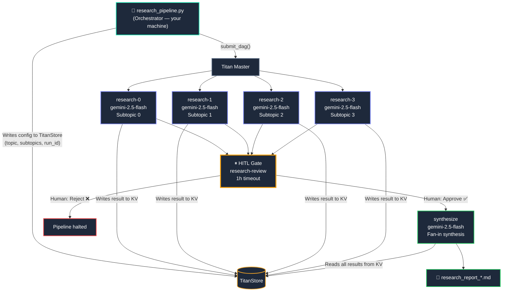
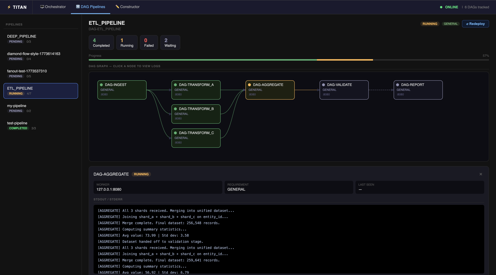

# Multi-Agent Research Pipeline

This example shows a **complete agentic workflow** built on Titan — the kind that is awkward or impossible to express in static DAG tools like Airflow or Prefect.

A research topic is broken into subtopics at runtime. Parallel Gemini agents research each subtopic independently on the distributed cluster. A human reviews before the final synthesis runs. The result is a polished Markdown report generated entirely by the agent network.



---

## What Titan Features This Demonstrates

| Feature | Where it appears |
|---|---|
| **Dynamic DAG construction** | Job count is `len(subtopics)` — add more topics, get more parallel workers |
| **TitanStore as agent memory** | Orchestrator writes config; research workers write results; synthesis reads all of it |
| **Parallel fan-out** | All 4 research jobs dispatch simultaneously across available workers |
| **Fan-in dependency** | HITL gate and synthesis cannot start until all research jobs complete |
| **Human-in-the-Loop** | Gate halts execution and waits for your Approve/Reject in the Dashboard |
| **Live log streaming** | Each Gemini response streams to the Dashboard log viewer in real time |
| **Capability routing** | Workers declare `GENERAL`; adding a `GPU` worker would let you route synthesis there |

---

## Prerequisites

=== "Install"

    ```bash
    # 1. Gemini SDK — needed on every worker node
    pip install google-genai python-dotenv

    # 2. Set your API key in the environment
    export GEMINI_API_KEY="your_key_here"

    # 3. Make sure Titan is running
    ./titan-dev up
    ```

=== "Worker scripts"

    Worker scripts live alongside the orchestrator — no extra setup needed:

    | Script | Purpose |
    |---|---|
    | `research_pipeline/research_subtopic.py` | Calls Gemini to research one subtopic, stores result in TitanStore |
    | `research_pipeline/synthesize_report.py` | Reads all subtopic results, calls Gemini for final synthesis |
    | `research_pipeline/hitl_gate.py` | Pauses execution and waits for Dashboard Approve/Reject |

---

## Quick Start

```bash
# Default topic: "The future of AI agents in software engineering"
python titan_test_suite/examples/agents_examples/research_pipeline/research_pipeline.py

# Custom topic
python research_pipeline.py "Quantum computing in finance"

# Custom topic + custom subtopics (2–8 subtopics)
python research_pipeline.py "LLM safety" \
  "Alignment research" \
  "Red-teaming & adversarial prompting" \
  "Interpretability methods" \
  "Governance and regulation"
```

---

## What Happens Step by Step

### 1. Orchestrator stores config in TitanStore

Before submitting the DAG, the orchestrator writes the research config into TitanStore so every worker can read it — even across different machines:

```python
client.store_put(f"titan:research:{run_id}:topic",      topic)
client.store_put(f"titan:research:{run_id}:count",       str(len(subtopics)))
client.store_put(f"titan:research:{run_id}:subtopic:0", subtopics[0])
client.store_put(f"titan:research:{run_id}:subtopic:1", subtopics[1])
# ... etc
```

Each worker reads its assigned subtopic from this key rather than receiving it in args — this avoids shell-quoting issues with complex text.

### 2. Dynamic DAG is built and submitted

```python
research_jobs = [
    TitanJob(
        job_id    = f"research-{i}",
        filename  = "perm_files/research_subtopic.py",
        args      = f"{run_id} {i}",
        requirement = "GENERAL",
        priority  = 5,
    )
    for i in range(len(subtopics))   # ← N jobs, built at runtime
]

gate_job = TitanJob(
    job_id   = "research-review",
    filename = "perm_files/hitl_gate.py",
    args     = "research-review 3600 All subtopics complete. Approve synthesis?",
    parents  = [f"research-{i}" for i in range(len(subtopics))],  # ← waits for ALL
)

synthesis_job = TitanJob(
    job_id   = "synthesize",
    filename = "perm_files/synthesize_report.py",
    args     = run_id,
    parents  = ["research-review"],   # ← cannot run until human approves
    priority = 8,
)

client.submit_dag(dag_name, research_jobs + [gate_job, synthesis_job])
```

### 3. Research workers run in parallel

Each research worker:

1. Reads the main topic and its subtopic from TitanStore
2. Calls Claude Sonnet with a focused research prompt
3. Writes the result back to TitanStore: `titan:research:{run_id}:result:{i}`
4. Streams the Claude response directly to the Dashboard log viewer

You can watch all 4 workers running simultaneously in the Dashboard:



### 4. HITL gate activates

Once all research jobs complete, the amber HITL banner appears in the Dashboard. This is your chance to review what the agents found before committing Claude Opus API credits to synthesis.

- **Approve** → synthesis job starts immediately
- **Reject** → synthesis job is never dispatched; pipeline ends here

!!! tip "Reviewing before approval"
    Fetch the raw research results from TitanStore to preview before approving:
    ```python
    from titan_sdk import TitanClient
    c = TitanClient()
    for i in range(4):
        print(c.store_get(f"titan:research:{run_id}:result:{i}"))
    ```

### 5. Synthesis fan-in

The synthesis job:

1. Reads all subtopic results from TitanStore
2. Combines them into a structured prompt for Claude Opus
3. Generates a full professional report: Executive Summary → Key Findings → Analysis → Conclusion
4. Stores the final report in TitanStore at `titan:research:{run_id}:report`
5. Streams the full report to the Dashboard log viewer

---

## Reading the Output

The final report is saved to the worker's local workspace. To fetch it:

```bash
# Option 1 — read from the Dashboard log viewer
# Click on the "synthesize" node in the DAG view after it completes.

# Option 2 — read from TitanStore (first 4000 chars)
python3 -c "
from titan_sdk import TitanClient
c = TitanClient()
print(c.store_get('titan:research:<run_id>:report'))
"
```

---

## Extending the Pipeline

### Add more subtopics

Pass them as CLI args:

```bash
python research_pipeline.py "Edge AI" \
  "Hardware constraints" \
  "Model compression techniques" \
  "On-device inference" \
  "Privacy implications" \
  "Industry adoption" \
  "Future silicon roadmap"
```

Seven parallel workers will fan out across your cluster automatically.

### Route synthesis to a GPU worker

If you have a GPU-tagged worker for faster inference:

```python
synthesis_job = TitanJob(
    job_id      = "synthesize",
    filename    = "perm_files/synthesize_report.py",
    args        = run_id,
    parents     = ["research-review"],
    requirement = "GPU",           # ← routes to GPU-tagged worker
    priority    = 8,
)
```

### Add a second HITL gate after synthesis

Useful if the report needs editorial approval before being published:

```python
publish_gate = TitanJob(
    job_id   = "publish-review",
    filename = "perm_files/hitl_gate.py",
    args     = "publish-review 1800 Final report ready. Approve publication?",
    parents  = ["synthesize"],
)
publish_job = TitanJob(
    job_id   = "publish",
    filename = "perm_files/publish_report.py",
    args     = run_id,
    parents  = ["publish-review"],
)
```

### Run multiple research pipelines in parallel

Each orchestrator invocation gets a unique `run_id` and submits an independent DAG:

```bash
# Three topics running on the same cluster simultaneously
python research_pipeline.py "Quantum networking" &
python research_pipeline.py "CRISPR therapeutics" &
python research_pipeline.py "Autonomous vehicles" &
```

---

## Under the Hood

!!! info "Why TitanStore instead of passing data through args?"
    Claude's research output is 200–400 words per subtopic — far too large to pass as a CLI argument and fragile with special characters. TitanStore acts as a **shared blackboard** between agents: the orchestrator writes the plan, each worker writes its findings, and the synthesis job reads them all. This pattern scales cleanly to N workers without changing any interfaces.

!!! info "Why HITL between research and synthesis?"
    Claude Opus synthesis is significantly more expensive than Sonnet research. The HITL gate lets you inspect the raw research quality and abort before committing to the final synthesis call — especially useful when exploring new topics where you aren't sure the subtopic breakdown is right.

!!! info "Why not pass `run_id` via environment variable?"
    The Titan SDK sends scripts as base64-encoded payloads. Environment variables set in the orchestrator are not forwarded to worker processes. Args are the right channel for per-run config; TitanStore is right for per-run data.
