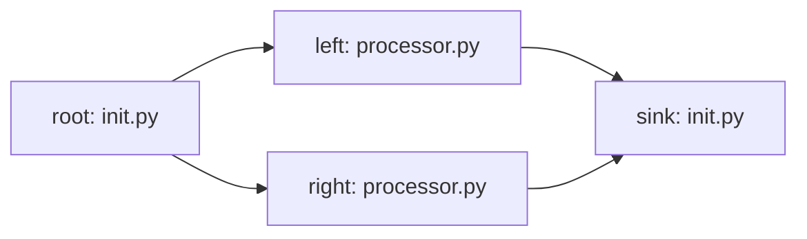
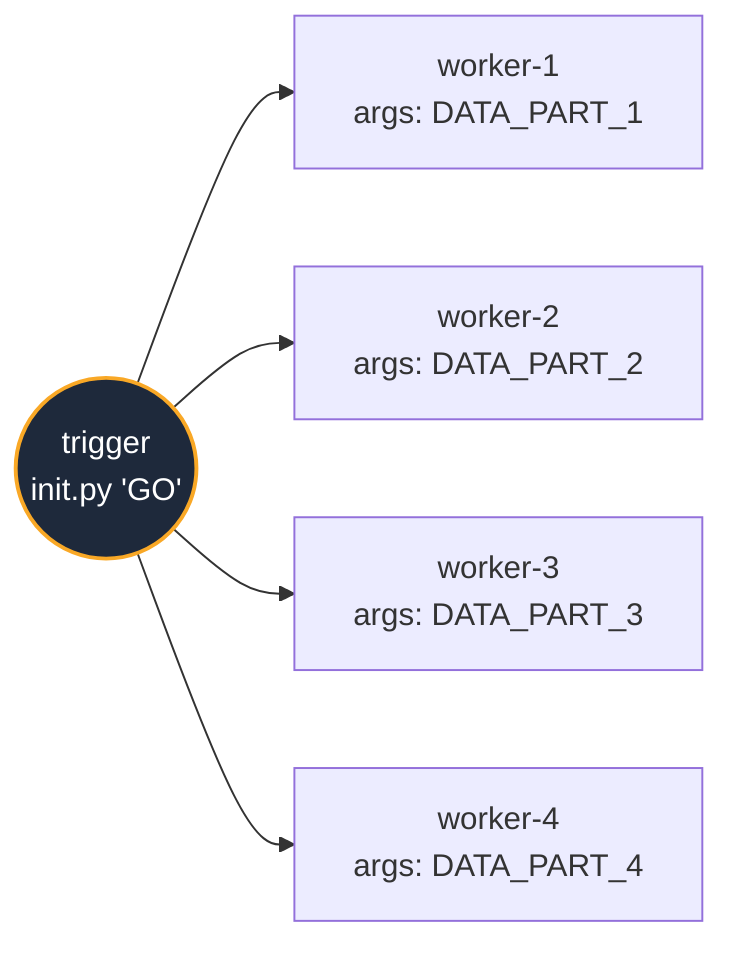
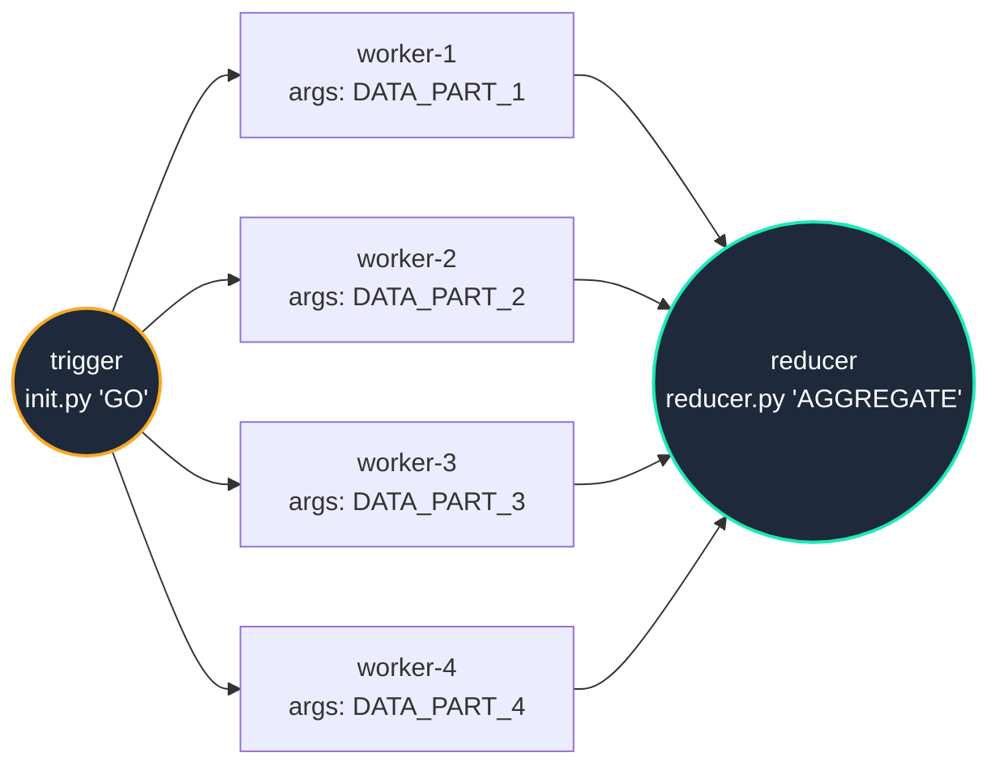
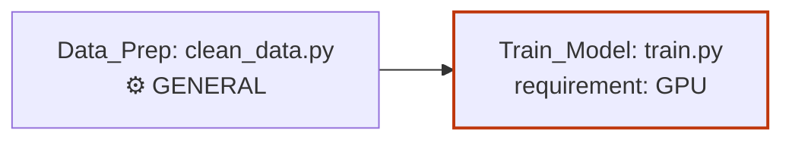
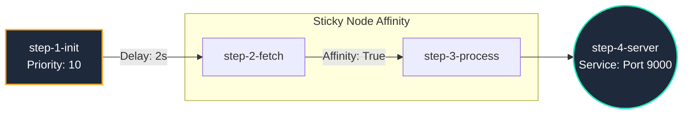

# 📄 Static Pipelines (YAML)

*Best for: Scheduled tasks, ETL pipelines, and known dependencies.*

For standard infrastructure tasks, you don't need to write Python orchestration code. You can define deterministic DAGs in a declarative YAML file. Titan will automatically parse this, zip your scripts, and distribute them to the cluster.

## 1. The Basics: The Diamond Pattern
If you just want to run tasks and don't care which node they land on, keep it simple. If you omit the `requirement` field, Titan automatically defaults to routing tasks to `GENERAL` workers. 

Here is a minimal "Diamond Pattern" DAG where a root task fans out into two parallel tasks, which then converge into a single sink.

Create a file named `diamond-flow.yaml`:

```yaml
name: "diamond-flow-style"
version: "1.0"
project: true # Tells Titan to zip the surrounding folder

jobs:
  - id: "root"
    type: "run"
    file: "scripts/init.py"

  - id: "left"
    type: "run"
    file: "src/processor.py"
    depends_on: ["root"]

  - id: "right"
    type: "run"
    file: "src/processor.py"
    depends_on: ["root"]

  - id: "sink"
    type: "run"
    file: "scripts/init.py"
    depends_on: ["left", "right"]

```


### Deploying the Pipeline
Use the Titan CLI to submit this DAG to your cluster:

```Bash
python titan_sdk/titan_cli.py deploy diamond-flow.yaml
```

### How Titan Handles This:

1. Root is queued immediately.

2. Once root succeeds, Titan detects that left and right are both unblocked and dispatches them simultaneously to available workers.

3. Sink waits until both parallel tasks finish successfully before executing

## 2. Parallel Processing: The Fan-Out Pattern

*Best for: Data chunking, parallel web scraping, or triggering multiple independent jobs from a single event.*

When you need to process massive amounts of data quickly, you can use the "Fan-Out" pattern. A single root task acts as a trigger, which then simultaneously unblocks multiple independent worker tasks. Titan will instantly distribute these workers across your cluster to process everything in parallel.

Create a file named `fanout-test.yaml`:

```yaml
name: "fanout-test"
version: "1.0"
project: true

jobs:
  - id: "trigger"
    type: "run"
    file: "scripts/init.py"
    args: "GO"

  - id: "worker-1"
    type: "run"
    file: "src/processor.py"
    args: "DATA_PART_1"
    depends_on: ["trigger"]

  - id: "worker-2"
    type: "run"
    file: "src/processor.py"
    args: "DATA_PART_2"
    depends_on: ["trigger"]

  - id: "worker-3"
    type: "run"
    file: "src/processor.py"
    args: "DATA_PART_3"
    depends_on: ["trigger"]

  - id: "worker-4"
    type: "run"
    file: "src/processor.py"
    args: "DATA_PART_4"
    depends_on: ["trigger"]
```

### Deploying the Pipeline
Use the Titan CLI to submit this DAG to your cluster:
```bash
python titan_sdk/titan_cli.py deploy fanout-test.yaml
```




### How Titan handles this:
**The Trigger:** The trigger task is queued immediately and executed on a single worker node.

**The Fan-Out Event:** Once trigger completes successfully, Titan evaluates the DAG and detects that four separate tasks are suddenly unblocked.

**Parallel Dispatch:** Titan's Master node immediately pushes all four worker tasks into the scheduling queue and distributes them across the cluster. If you have four idle nodes, they will all execute simultaneously.


### 2.1 Adding a Reducer (Fan-In)
To turn this into a full MapReduce pipeline, simply add one final "sink" node that depends on all of your parallel workers. Titan's scheduler will automatically hold this reducer task in the queue until every single worker has successfully finished.
```yaml
# Retain the Fan out YAML and add this
- id: "reducer"
    type: "run"
    file: "src/reducer.py"
    args: "AGGREGATE_ALL"
    depends_on: ["worker-1", "worker-2", "worker-3", "worker-4"]
```



### How Titan handles this:

1. **The Trigger:** The `trigger` task is queued immediately and executed.
2. **The Map Phase (Fan-Out):** Once `trigger` completes, Titan detects multiple unblocked tasks and distributes them across the cluster to run in parallel.
3. **The Reduce Phase (Fan-In):** The `reducer` task is blocked by its dependencies. The exact millisecond the final worker completes, the `reducer` task is unblocked and dispatched to aggregate the final data.


## 3. Advanced: Hardware-Aware Routing
When you have a heterogeneous cluster (e.g., some cheap CPU VMs and one expensive GPU machine), you can use the ``requirement`` tag to enforce strict node affinity.

```yaml
jobs:
  - id: "Data_Prep"
    type: "run"
    file: "scripts/clean_data.py"
    # Defaults to GENERAL. Will run on any standard node.
    
  - id: "Train_Model"
    type: "run"
    file: "scripts/train.py"
    depends_on: ["Data_Prep"]
    requirement: "GPU" # Titan guarantees this ONLY lands on a GPU-tagged node
```



### Deploying the Pipeline
Use the Titan CLI to submit your YAML DAG to the active cluster:

```
python titan_sdk/titan_cli.py deploy diamond-flow.yaml
```

## 3. Deploying a Long-Running Service
Titan isn't just for ephemeral scripts; it can act as a Micro-PaaS to host APIs. Use type: service to tell the worker to keep the process alive.

```yaml
jobs:
  - id: "FastAPI_Backend"
    type: "service"
    file: "src/server.py"
    port: 8000 # Required for services
    args: "--host 0.0.0.0 --reload"
```

### Deploying the Pipeline
Use the Titan CLI to submit any YAML DAG to the active cluster:
```bash
python titan_sdk/titan_cli.py deploy my_pipeline.yaml
```

## 4. Advanced: Combined Essentials version

If you need fine-grained control over execution timing, hardware locality, and background services, Titan supports advanced scheduling flags. 

This example demonstrates queue priorities, artificial delays, strict task affinity (forcing a task to run on the exact same physical node as its parent to leverage local file caches), and deploying a long-running background service.

Create `comprehensive-flow.yaml`:

```yaml
name: "titan-comprehensive-test"
project: true  # Activates Archive/Sandbox Mode

jobs:
  # SCENARIO 1: High Priority Task
  - id: "step-1-init"
    type: "run"
    file: "scripts/init.py"
    priority: 10              # Highest priority in the queue
    args: "--mode reset"

  # SCENARIO 2: Delayed Execution
  - id: "step-2-fetch"
    type: "run"
    file: "src/processor.py"
    args: "FETCH"
    delay: 2                  # Scheduler waits 2 seconds after unblocking
    depends_on: ["step-1-init"]

  # SCENARIO 3: Sticky Scheduling (Affinity)
  - id: "step-3-process"
    type: "run"
    file: "src/processor.py"
    args: "PROCESS_DATA"
    affinity: true            # MUST run on the exact worker that ran 'step-2-fetch'
    depends_on: ["step-2-fetch"]

  # SCENARIO 4: Long-Running Service
  - id: "step-4-server"
    type: "service"
    file: "src/server.py"
    port: 9000                # Keeps the process alive and binds to this port
    depends_on: ["step-3-process"]

```




### Deploying the Pipeline
Use the Titan CLI to submit your YAML DAG to the active cluster:

```bash
python titan_sdk/titan_cli.py deploy comprehensive-flow.yaml
```

### 📚 Full YAML Schema Reference

#### Root Level Parameters

| Field | Type | Default | Description |
| :--- | :--- | :--- | :--- |
| `name` | String | `titan_agent` | The name of the project. Used when naming the generated zip artifact. |
| `project` | Boolean | `true` | If `true`, Titan zips the entire surrounding folder and sends it to the worker. If `false`, it attempts to run the file using an absolute path on the worker node. |
| `jobs` | List | `[]` | A list of job definition blocks. |

#### Job Level Parameters

| Field | Type | Default | Description |
| :--- | :--- | :--- | :--- |
| `id` | String | **Required** | A unique identifier for the task within this DAG. |
| `file` | String | **Required** | The relative path to the script to execute. |
| `type` | String | `run` | `run` for ephemeral tasks. `service` for long-running servers. |
| `depends_on` | List[String] | `[]` | A list of parent ids that must complete successfully before this task runs. |
| `requirement` | String | `GENERAL` | The hardware tag required to run this task (e.g., `GPU`, `HIGH_MEM`). |
| `priority` | Integer | `1` | Queue priority. Higher numbers are scheduled first. |
| `delay` | Integer | `0` | Delay in seconds before the task is allowed to execute after unblocking. |
| `affinity` | Boolean | `false` | If `true`, Titan attempts to route this task to the exact same physical node as its parent task to leverage local file caching. |
| `port` | Integer | None | **Required** if `type: service`. The network port the service will bind to. |
| `args` | String | `""` | Command-line arguments appended to the execution command. |