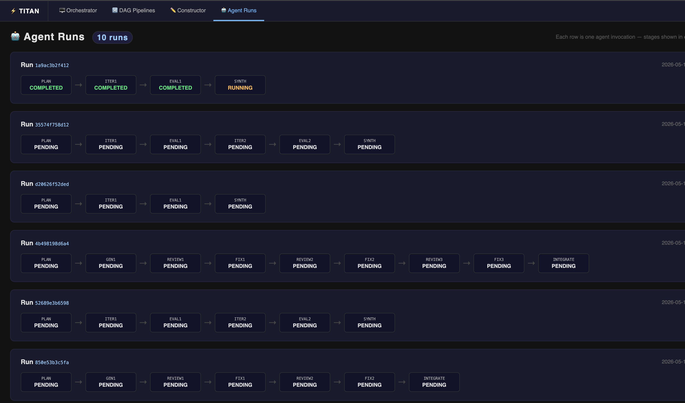
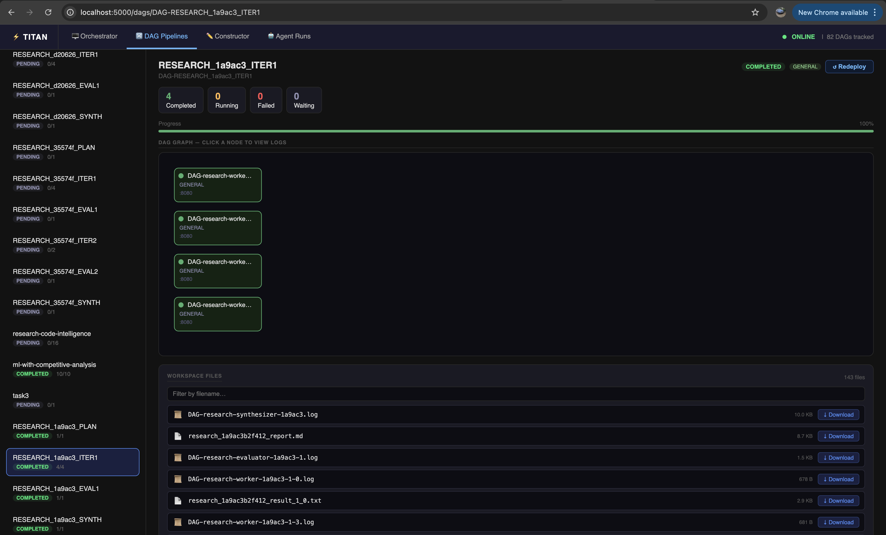

# Agent Runs

## Why this view exists

In a regular pipeline, the full DAG is known before execution starts. You submit one graph, watch it run, it finishes. The DAG Pipelines view handles this well — one entry, one graph.

Agents are different. An agent does not know its full execution plan upfront. It reasons at runtime:

1. A **Planner** stage runs first — an LLM decides what subtopics to investigate, how many workers to spawn, what the next step should be
2. Based on the planner's output, the orchestrator submits a new **Researcher** DAG with N parallel workers (N was unknown before the planner ran)
3. An **Evaluator** stage reads the results and decides: synthesize now, or loop and go deeper?
4. If looping, a second **Researcher** DAG is submitted — again with a shape determined at runtime
5. Eventually a **Synthesizer** DAG fans in everything into a final report

Each of these is a **separate DAG submission** — not nodes within one DAG. The orchestrator (Python code running between stages) bridges them by reading TitanStore, making decisions, and calling `submit_dag()` again.

This means in the DAG Pipelines view, one agent run produces many unrelated-looking entries scattered across the list:

```
RESEARCH_1a9ac3_PLAN
RESEARCH_1a9ac3_ITER1
RESEARCH_1a9ac3_EVAL1
RESEARCH_1a9ac3_ITER2
RESEARCH_1a9ac3_EVAL2
RESEARCH_1a9ac3_SYNTH
```

Without context, these look like six independent pipelines. With 3–4 concurrent agent invocations, the list becomes unnavigable. **Agent Runs was added to solve this** — it groups all stages that share an `agent_run_id` into a single row so you can see the full lifecycle of one agent at a glance, track which iteration it is on, and spot failures in context.

---

## How agent DAGs differ from regular DAGs

| | Regular DAG | Agent DAG stage |
|---|---|---|
| **Graph shape at submit time** | Fully known | Unknown — decided by the previous stage |
| **Number of stages** | One | Multiple, determined at runtime |
| **Who bridges stages** | Nothing — it's one graph | The orchestrator (Python), running between submissions |
| **State between stages** | Not needed | Passed via TitanStore (shared KV) |
| **Visualizer entry** | One entry in DAG Pipelines | One entry per stage + grouped in Agent Runs |
| **Failure scope** | Whole DAG stops | Only that stage fails — orchestrator can retry or reroute |

The key insight: **a Titan agent is a loop around `submit_dag()`**, not a special graph type. Titan's runtime doesn't know or care that stages are related — that's the orchestrator's job. Agent Runs is purely a dashboard convenience that reads the `agent_run_id` tag to reconstruct the full picture.

---

## The view

The **Agent Runs** view at `http://127.0.0.1:5000/agents` groups all stages that share an `agent_run_id` into a single row, shown left to right in submission order.



---

## What it shows

Each row represents one agent invocation. Stages are shown left to right in submission order with arrows between them:

```
Run  RESEARCH_cb5e13
  PLAN  →  ITER1  →  ITER2  →  EVAL1  →  SYNTH
  ✓         ✓         ✓        ⟳         …
```

Each stage box shows:

- **Stage label** — the short name stripped of the common run ID prefix
- **Status** — `COMPLETED`, `RUNNING`, `FAILED`, `WAITING`, or `PARTIAL`
- Clicking a stage box navigates to that stage's [DAG Visualizer](overview.md)

The page auto-refreshes every **3 seconds**.

---

## How to populate it

Pass an `agent_run_id` when submitting each stage of an agent:

```python
from titan_sdk import TitanClient, TitanJob

client = TitanClient()

run_id = "RESEARCH_cb5e13"   # shared across all stages of this invocation

# Stage 1 — Plan
client.submit_dag(
    f"{run_id}_PLAN",
    [TitanJob(job_id="plan", filename="plan.py")],
    agent_run_id=run_id,
)

# Stage 2 — Execute (submitted after plan completes)
client.submit_dag(
    f"{run_id}_EXECUTE",
    [TitanJob(job_id="execute", filename="execute.py")],
    agent_run_id=run_id,
)
```

All DAGs submitted with the same `agent_run_id` are grouped under one row. The stages appear in the order they were submitted.

!!! tip
    Use a unique ID per invocation — a short UUID or timestamp suffix works well:
    ```python
    import uuid
    run_id = f"RESEARCH_{uuid.uuid4().hex[:6]}"
    ```

---

## Stage statuses

| Status | Colour | Meaning |
|---|---|---|
| `COMPLETED` | Green | All jobs in this stage finished successfully |
| `RUNNING` | Amber | At least one job is actively executing |
| `FAILED` | Red | One or more jobs failed |
| `PARTIAL` | Purple | Mixed — some completed, some failed |
| `WAITING` | Grey | No jobs have started yet |

---

## When does a run appear?

Agent runs appear automatically as soon as the first stage with an `agent_run_id` is submitted. No manual configuration needed. The view is **passive** — if no agents have run yet, it shows an empty state.

---

## Drilling into a stage

Click any stage box to open the full DAG Visualizer for that stage — showing its job graph, logs, and workspace files.



The URL follows the pattern `/dags/DAG-<dag_name>` — for example, the ITER1 stage of run `1a9ac3` opens at `/dags/DAG-RESEARCH_1a9ac3_ITER1`. From here you can inspect individual worker logs, download output files, and see exactly what each parallel worker produced.

---

## Relationship to DAG Pipelines

Each stage in an Agent Run is also a full DAG visible in the [DAG Pipelines](overview.md) view. Agent Runs is purely a grouping view — it does not change how the underlying DAGs execute. You can click any stage to drop into the full per-stage visualizer for logs, HITL gates, and workspace files.

---

## Example — Multi-Agent Research Pipeline

The [Multi-Agent Research Pipeline](../examples/research-pipeline.md) example produces an Agent Runs entry with stages like:

```
PLAN  →  ITER1  →  EVAL1  →  ITER2  →  EVAL2  →  SYNTH
```

Each iteration is an independent DAG submitted with the same `agent_run_id`, so the Agent Runs view shows the full research loop at a glance.
