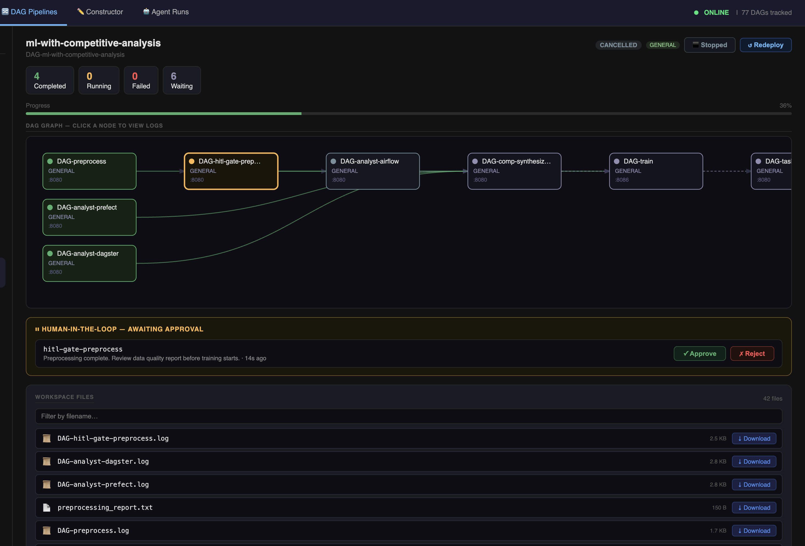

# HITL Approval

When a pipeline contains a HITL gate, the DAG Visualizer becomes the approval interface. The gate pauses execution and waits for a human decision before downstream jobs proceed.

---

## The approval banner

When a gate is waiting, a banner appears at the bottom of the visualizer:

The banner shows:

- The **gate message** configured on the source node in the constructor
- An **Approve** button (green)
- A **Reject** button (red)
- The gate job ID for reference

The banner is polled every 2 seconds — it appears automatically when a gate becomes active, without requiring a page refresh.

---

## Making a decision

### Approve
Click **Approve** to allow the pipeline to continue. The gate job completes successfully and all downstream jobs are released to run.

### Reject
Click **Reject** to stop the pipeline at this gate. The gate job fails and downstream dependents are cancelled.

---

## Reviewing output before deciding

Use the [Workspace Files panel](workspace-files.md) to download and review job outputs before making a decision.

A typical pre-training review workflow:

1. `preprocess` completes — `preprocessing_report.txt` appears in the files panel
2. The HITL banner appears: *"Review data quality report before training begins"*
3. Click `preprocessing_report.txt` to download and review it
4. If data quality is acceptable → **Approve** → training proceeds
5. If data looks wrong → **Reject** → training is cancelled, investigate preprocess

---

## Gate timeout

If no decision is made within the configured timeout period, the gate automatically fails. Downstream jobs are cancelled.

The timeout is set per-gate in the constructor's **Gate Timeout** field. Default is 48 hours.

---

## Gate job in the graph

The gate node is visible in the pipeline graph like any other job:

| Gate status | Meaning |
|---|---|
| `RUNNING` (blue) | Waiting for human approval |
| `COMPLETED` (green) | Approved — downstream jobs released |
| `FAILED` (red) | Rejected or timed out |

Click the gate node to open its log stream, which shows registration confirmation and wait status.

---

## Multiple gates in one pipeline

A pipeline can have multiple HITL gates — one per source node that has a gate configured. Each gate has its own banner entry and must be approved or rejected independently. The banner shows them one at a time as they become active.
