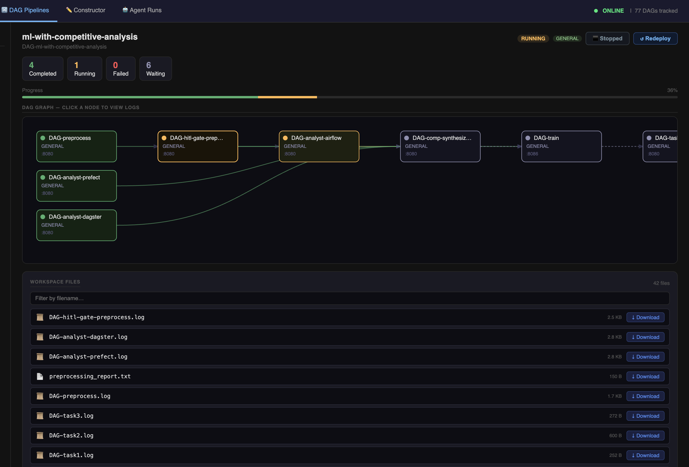
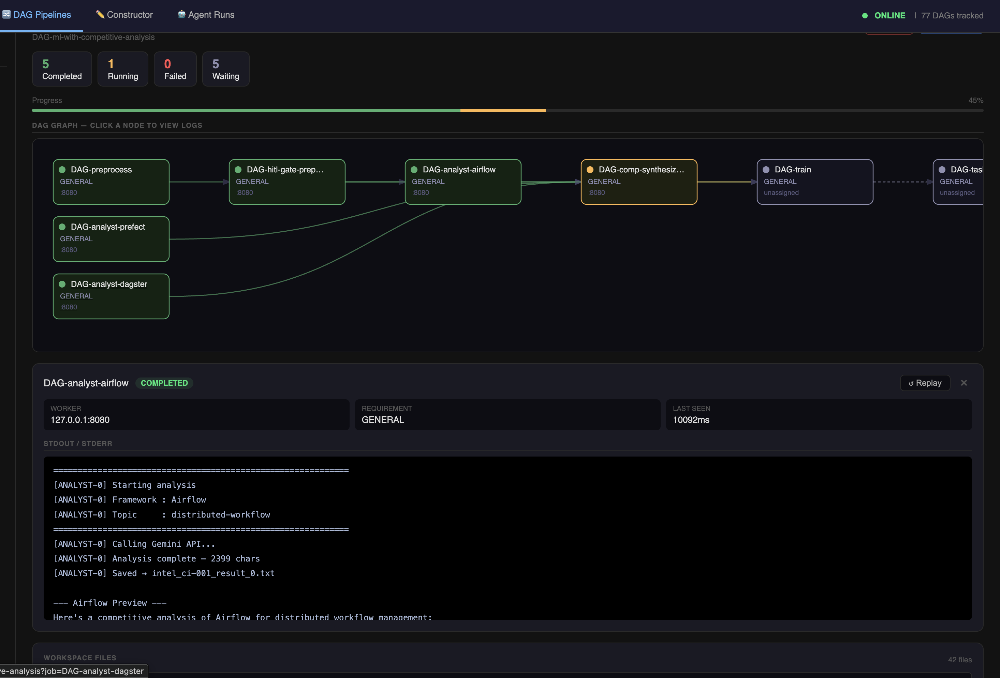

# Monitoring & Logs

## Job status colours

Each node in the pipeline graph is colour-coded to reflect the current job state:

| Colour | Status | Meaning |
|---|---|---|
| Gray | `PENDING` | Waiting for dependencies to complete, or for a worker |
| Blue (pulsing) | `RUNNING` | Actively executing on a worker |
| Green | `COMPLETED` | Finished successfully |
| Red | `FAILED` | Exited with a non-zero code or was rejected |
| Muted / dim | `CANCELLED` | Cancelled due to an upstream failure or manual stop |

---

## Reading the graph

Edges (arrows) show dependency direction: an arrow from A to B means B depends on A.

- Jobs at the top (no incoming edges) run first
- Jobs fan out in parallel when their shared dependency completes
- Fan-in jobs (multiple incoming edges) wait for all parents

HITL gate nodes appear as regular nodes in the graph — they show as `RUNNING` while waiting for approval and `COMPLETED` once approved.

---

## Viewing job logs

Click any node in the graph to open its log panel on the right side of the screen.

The log panel shows:

- Raw stdout and stderr from the worker process
- Auto-refreshes every 2 seconds while the job is `RUNNING`
- Full output available for completed and failed jobs
- Scroll to follow the tail as new lines arrive

Logs are fetched from `/api/logs_raw/<job-id>` and are stored in `titan_workspace/shared/DAG-<job-id>.log`.

### Diagnosing a failure

When a job shows red (`FAILED`):

1. Click the node to open its log panel
2. Scroll to the bottom — the error or traceback appears at the end
3. Common causes: wrong args format, missing dependency, script exception, worker OOM

---

## DAG list view

`http://127.0.0.1:5000/dags` shows all submitted DAGs with:

- DAG name
- Overall status (derived from job statuses)
- Total job count
- Link to the individual visualizer

<!-- Screenshot: /dags list page showing several DAGs with their statuses -->
!!! note "Screenshot needed"
    `visualizer_dag_list.png` — DAGs list page with multiple pipelines

---

## Stopping a job

Running jobs can be stopped from the dashboard. A stopped job transitions to `CANCELLED` and downstream dependents do not run.
