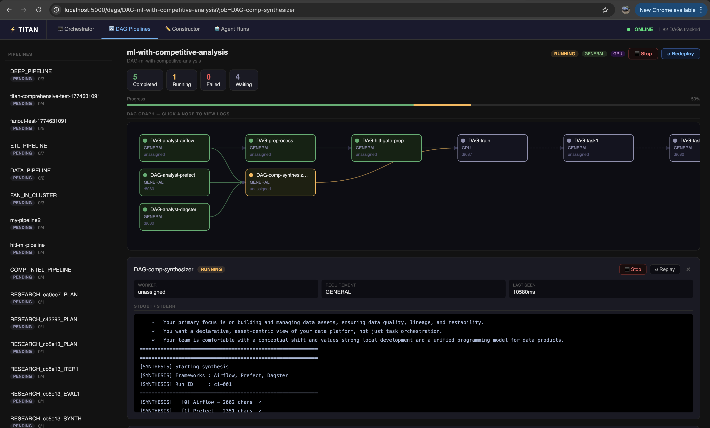

# DAG Visualizer — Overview

The DAG Visualizer is the live operational view for a submitted DAG. It shows the pipeline graph, real-time job status, logs, HITL approval controls, and output files — all in one place.



---

## How to open it

**From the constructor** — after a successful deploy, click **"✓ Deployed — View DAG →"** in the topbar.

**From the dashboard** — go to `http://127.0.0.1:5000/dags`, find your DAG in the list, click its name.

**Direct URL** — `http://127.0.0.1:5000/dags/DAG-<your-pipeline-name>`

**From the CLI** — after `titan submit`, the CLI prints the DAG name. Append it to the dashboard URL.

**From the SDK** — after `client.submit_dag(...)`, the DAG name is the prefix `DAG-` + the name you passed.

---

## Layout

```
┌────────────────────────────────────────────────┐
│  DAG header — name, overall status, back link  │
├──────────────────┬─────────────────────────────┤
│                  │                             │
│  Pipeline graph  │  Job log panel              │
│  (SVG)           │  (appears on node click)    │
│                  │                             │
├──────────────────┴─────────────────────────────┤
│  HITL approval banner  (appears when pending)  │
├────────────────────────────────────────────────┤
│  Workspace Files panel                         │
└────────────────────────────────────────────────┘
```

---

## Live polling

The visualizer polls the master every **2 seconds** for job status updates. Node colors update in place without a page reload. You do not need to manually refresh.

---

## Sections

- [Monitoring & Logs](monitoring.md) — job status colors, clicking nodes to view logs
- [HITL Approval](hitl-approval.md) — approving and rejecting gates at runtime
- [Workspace Files](workspace-files.md) — downloading output files generated by jobs
