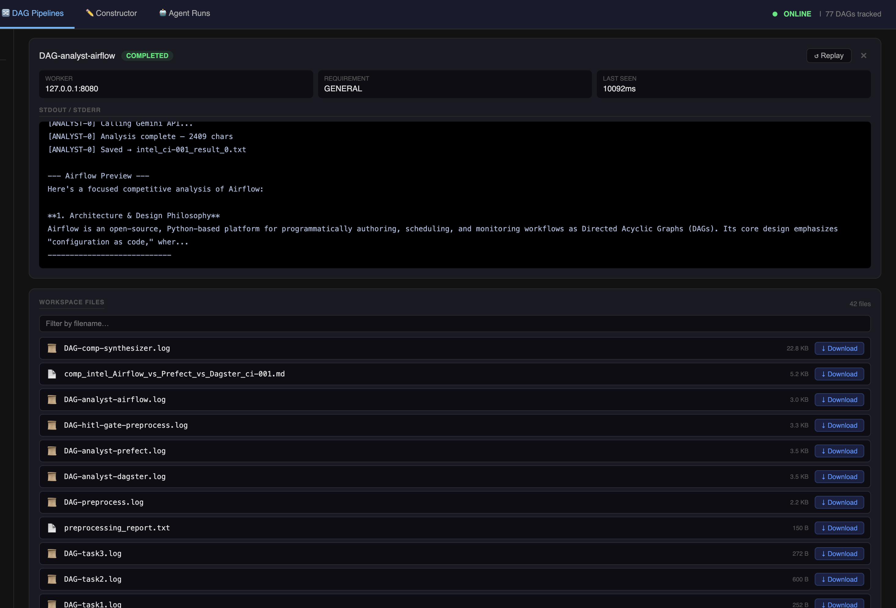

# Workspace Files

The Workspace Files panel shows output files generated by jobs in the current DAG run. Files are listed with size, last-modified timestamp, and a direct download link.



---

## Where files come from

Worker scripts write output to `titan_workspace/shared/` — a directory shared across all workers on the same host. Any file written there is immediately visible in the files panel.

```python
# In a worker script
import os

output_path = os.path.join(
    os.path.dirname(__file__), '..', 'titan_workspace', 'shared',
    'my_output.txt'
)
with open(output_path, 'w') as f:
    f.write(results)
```

Standard log files (`DAG-<job-id>.log`) are written automatically by the master for every job.

---

## Filtering

The panel filters files by the job names in the current DAG. It uses **token expansion** — job names are split on `-` and each token is matched independently against filenames.

For example, a job named `analyst-airflow` matches files containing `analyst` **or** `airflow`:

- `DAG-analyst-airflow.log` ✓ (matches "analyst-airflow")
- `comp_intel_Airflow_vs_Prefect_vs_Dagster_ci-001.md` ✓ (matches "airflow")
- `intel_ci-001_result_0.txt` ✓ (matches "intel")

Tokens shorter than 3 characters are ignored to avoid false matches.

---

## Downloading files

Each file entry has a download link. Click it to download the file directly from the server.

Files are served from `/api/workspace/file/<filename>`.

---

## Expected files per job type

| Job | Expected outputs |
|---|---|
| Any job | `DAG-<job-id>.log` — full stdout/stderr |
| Preprocessing | Domain-specific report file (e.g. `preprocessing_report.txt`) |
| LLM analyst jobs | Raw output text per analyst (e.g. `intel_ci-001_result_0.txt`) |
| Synthesizer jobs | Final synthesized report (e.g. `comp_intel_Airflow_vs_Prefect_vs_Dagster_ci-001.md`) |
| Training jobs | Model artifacts, metrics files |

---

## Using files for HITL decisions

The files panel is designed to work alongside the [HITL approval flow](hitl-approval.md). Download and review a job's output before approving or rejecting the gate that follows it.

---

## File persistence

Files in `titan_workspace/shared/` persist across DAG runs. They are not automatically cleaned up. If you run the same pipeline multiple times, output files are overwritten if the worker uses the same filename, or accumulate if filenames include run IDs or timestamps.
